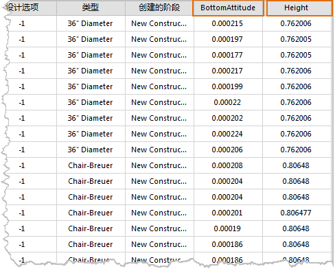

---
id: ModelToPolygon
title: 模型数据转为二维面数据  
---  
### 使用说明

通过本功能，可将模型数据集转换为二维面数据，转换后，相当于将模型数据集中的所有模型对象投影到XY（二维）平面上，生成二维面数据集。

### 操作步骤

  1. 在“工作空间管理器”中打开存有模型数据集的数据源；
  2. 在“数据”选项卡的“数据处理”组中，单击“类型转换”按钮的下拉箭头，在弹出的菜单中选择“模型数据->二维面数据”命令，弹出“模型数据->二维面数据”对话框；
  3. 在对话框中单击“添加按钮”（或在列表框空白区域双击左键），弹出选择对话框，选择待转换的模型数据集，单击“确定”按钮；
  4. 在对话框列表区域设置源数据源和结果数据源；
  5. 设置完成后，单击“转换”按钮，完成操作。

转换成功后，打开二维面数据集的属性表，平台为其自动生成了“BottomAttitude”与“Height”两个属性字段，其中“BottomAttitude”记录了该二维面对应转换前模型对象的底部高程，“Height”记录了转换前模型对象的高度。

  

  

