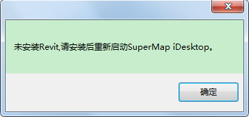

---
id: OpenBIM
title: 打开BIM数据  
---  
### 使用说明

“打开BIM数据”命令，可用来打开RVT数据或3DXML数据，并在工作空间管理器中新增RVT/3DXML临时数据源节点，需要保存工作空间才能保存导入的模型数据集。

### 操作步骤

  1. 右键单击工作空间管理器中的数据源节点，在弹出的右键菜单中选择“ **打开BIM数据** ”，弹出“打开”对话框，选择需要打开的RVT或3DXML文件，然后单击“打开”按钮。弹出“导入RVT文件-Revitxxxx”对话框或“3DXML数据导入”对话框，这里的“xxxx”是指Revit的版本号。
  2. RVT文件设置：
      * 文件列表：文件列表显示了当前打开的文档的可供导出族，默认全部导出，可选择是否勾选族前的复选框进行部分导出。
      * 视图:选择导出模型的视图，默认为三维视图。视图与过滤色绑定，决定打开模型的材质颜色。
      * 模型定位点：模型导入时的位置，用一个三维点对象表示。默认定位点为（0,0,0）。 
      * 投影坐标系：支持投影设置和导入投影文件两种方式设置投影坐标系，详细操作步骤请参见“[设置投影坐标系](../../DataProcessing/Projection/PrjCoordSysDia)”
      * 颜色设置：提供着色颜色和真实颜色两种颜色模式。 
        * 真实模式有贴图只保留贴图不要颜色，没有贴图保留颜色
        * 着色模式不考虑贴图只留颜色
      * 高级选项： 
        * 导出LOD：设置导出后的模型是否带LOD，默认勾选。
        * 实例化：设置的模型是否以实例化形式存储，默认勾选以防止数据膨胀。
        * 拓扑闭合：设置模型是否拓扑闭合，默认勾选。
        * 过滤色：导出模型的颜色以过滤色为最高优先级，如果满足过滤条件则赋予过滤色，有过滤色则没有贴图,否则为着色或真实颜色。默认勾选导出带过滤色。
        * 导出体量：用于包含建筑、房屋对象的RVT文件。
        * LOD精细度：当勾选导出LOD时，进行LOD简化百分比设置，设置范围为0-100%。
        * 导出明细表：设置是否导出Revit明细表。若勾选则导出Revit文件的明细表，导出后以属性表数据集格式呈现。
        * 导出二维视图：设置是否导出Revit二维视图，若勾选则导出Revit文件的视图。导出后，在生成的UDB数据同级目录下生成相应文件夹，文件夹内为DWG文件，即导出的二维视图以CAD数据集格式呈现。
        * 最大读写数：针对大体量复杂数据内存暴涨情况，默认读写数为最大值500，可根据数据情况自定义大小。
      * 文件信息：包含文件路径、文件版本、用户名以及模型预览等内容。其中，用户名是[协同设计](../3DDesigner/CollaborativeDesign/CollaborativeDesignDia)时的相关信息。
  3. 3DXML文件设置
      * 文件列表：文件列表显示了当前打开的文件，可选择打开某一具体3DXML文件。
      * 基本信息设置
        * 目标数据源：通过右键下拉按钮选择导入的数据源。
        * 目标数据集：打开的模型数据集的名称。
        * 导入模式：默认为无。
      * 参数设置：
        * 模型参考点（模型中心点位置）：模型导入时的位置，用一个三维点对象表示。默认定位点为（0,0,0）。 
        * 投影坐标系：支持投影设置和导入投影文件两种方式设置投影坐标系，详细操作步骤请参见“[设置投影坐标系](../../DataProcessing/Projection/PrjCoordSysDia)”。
  4. 单击“确定”按钮，打开RVT或3DXML数据。同时工作空间管理器中新增打开的RVT或3DXML临时数据源节点。
  5. 将打开的RVT/3DXML格式数据添加到场景中，如下图所示：     
    

### 注意事项

  1. 特别说明，打开RVT文件功能依赖.NET Framework 4.7版本及以上。
  2. 打开RVT文件是依赖于Revit软件的。如果没有安装Revit软件，那么当执行“打开RVT”时，会弹出如下提示对话框。   
  
  3. 由于Revit版本不同，生产数据的版本也会不同。因此若打开RVT文件的版本高于本地安装的Revit软件版本时，将无法打开，并且会在输出窗口显示错误提示信息。
  4. 小体量的BIM数据建议使用“打开BIM数据”功能，因为该功能一次只能打开一个文件；大体量的BIM数据适合“导入BIM数据”功能，因为该功能一次可以导入多个文件。

###  相关主题

 [导入RVT](ImportRVT)

 [导入3DXML](Import3DXML)

