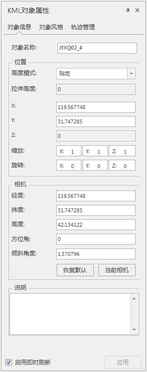
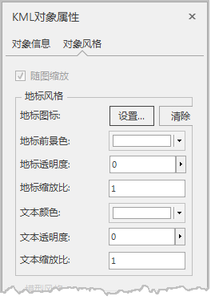
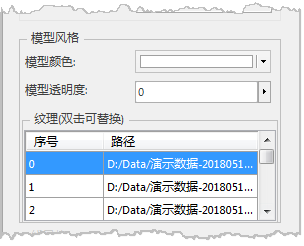
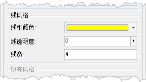
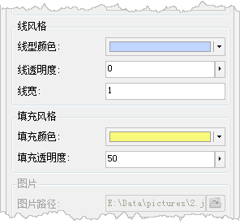
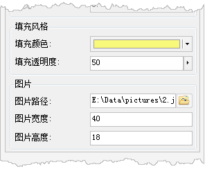

　　当场景中有选中的 KML图层中某个对象时，单击鼠标右键，在弹出的右键菜单中选择“属性”命令，即可弹出“KML对象属性”面板。“KML对象属性”面板中显示的是选中对象的详细属性信息。  
　　在“KML对象属性”面板中可查看或设置选中对象的对象信息和对象风格。下面详细介绍各类信息的具体内容。

**对象信息**

　　单击“KML对象属性”面板中的“对象信息”选项卡，面板会显示选中对象的空间属性等信息，用户可以对这些信息进行修改，若勾选了“启用即时刷新”复选框，KML
对象属性的修改将实时应用到选中的对象。

  

  * **对象名称：** 用于显示选中对象的名称。
  * **位置：**
    * **高度模式** ：设置选中 KML 对象使用的高度模式，有关高度模式，请参见:[关于高度模式](../AdvancedLayserSetting/AboutAltitudeMode  )的详细介绍。
    * **拉伸高度** ：若选中对象的的高度模式为相对地面或绝对高度，可在“拉伸高度”右侧组合框中，设置对象所在位置距离地球表面的高程值。 
    * **位置（X、Y、Z）** ：选中对象所在的地理位置，即经纬度坐标 X，Y（单位为度）和高程信息 Z（单位为米）。如果选中的对象为模型对象，该位置表示模型对象底部中心点的位置；如果选中对象为地标，则为地标点的位置。
  * **缩放：**
    * **缩放（X、Y、Z）** ：选中对象在 X、Y、Z 方向的缩放比例值。仅对模型对象有效。
  * **旋转：**
    * **旋转（X、Y、Z）** ：选中对象的旋转角度值，包括绕 X、Y、Z 轴的旋转角度值。仅对模型对象有效，同时，地表贴图支持设置旋转Z值。
  * **相机：**
    * **相机** ：该区域用于设置观测该选中对象的相机位置和方位角、倾斜角度，即当对该对象进行三维飞行时，飞行最终达到的观测角度。  
   　　在图层管理器中，双击 KML 图层下的某个对象结点，即可对 KML 图层中的该对象进行飞行，并且飞行的目的地为该对象的空间信息中所设置的相机位置。  
　　其中，“当前相机”按钮用来将当前场景的相机参数设置为选中对象的相机参数。“恢复默认”按钮用来将当前场景的相机参数进行重置，恢复至默认值，即使用对象位置的经纬度和1000m的高度作为默认相机参数。  
  * **说明：** 用于设置选中对象的备注信息。

**对象风格**

　　单击“KML对象属性”面板中的“对象风格”选项卡，对话框右侧区域将显示选中对象的风格信息，并且在这里可以修改选中对象的风格。

　　选中的 KML 图层中不同类型的对象，对象风格的设置内容也不同，可以分为：地标、面对象、线对象、模型和地表贴图。

1. 当选中的对象为 **地标** 时，对象风格的设置内容如下图所示：
   

      * **地标图标** ：设置图片对象来代替地标对象所显示的点符号。单击“设置”按钮，弹出“打开地标图标文件”对话框，选择打开的地标图标文件（*.PNG）即可。“清除”按钮用来取消点使用的图片对象。
      * **地标前景色** ：设置地标对象的点符号部分的显示颜色。单击颜色按钮，在弹出的颜色面板中选择和设置使用的颜色。 **注意** ：由于地标有自带颜色，设置地标前景色后，地标的显示颜色是设置颜色与地标自带颜色的叠加色，与设置组合框中的颜色稍有差异。
      * **地标透明度** ：设置地标对象的点符号部分的透明效果。数值的范围为 0 至 100 之间的整数值，0 代表完全不透明；100 代表完全透明。
      * **地标缩放比** ：设置地标对象的点符号部分的缩放比例。
      * **文本颜色** ：设置地标对象的文本标识部分的文本颜色。单击颜色按钮，在弹出的颜色面板中选择和设置使用的颜色。
      * **文本透明度** ：设置地标对象的文本标识部分的文本的透明效果。数值的范围为 0 至 100 之间的整数值，0 代表完全不透明；100 代表完全透明。
      * **文本缩放比** ：设置地标对象的文本标识部分的文本的缩放比例。
  2. 当选中的对象为 **模型对象** 时，模型对象的设置内容如下图所示：  
     
 
     * **模型颜色** ：在弹出的颜色面板中可设置模型的填充颜色。
     * **模型透明度** ：设置模型对象的填充颜色的透明效果。数值的范围为 0 至 100 之间的整数值，0 代表完全不透明；100 代表完全透明。
  3. 当选中的对象为 **线对象** 时，对象风格的设置内容如下图所示：  
     

     * **线型颜色** ：设置线对象的显示颜色。通过单击颜色按钮，在弹出的颜色面板中选择 和设置线的颜色。
     * **线透明度** ：设置线对象的透明效果。数值的范围为 0 至 100 之间的整数值，0 代表完全不透明；100 代表完全透明。
     * **线宽** ：设置线对象的线宽。
  4. 当选中的对象为 **面对象** 时，对象风格的设置内容如下图所示：   
      
   
     * **线风格：**
       * **线型颜色** ：设置面对象的轮廓线的显示颜色。通过单击颜色按钮，在弹出的颜色面板中选择和设置线的颜色。
       * **线透明度** ：设置面对象的轮廓线的透明效果。数值的范围为 0 至 100 之间的整数值，0 代表完全不透明；100 代表完全透明。
       * **线宽** ：设置面对象的轮廓线的线宽。
     * **填充风格：**
       * **填充前景色** ：设置面对象的填充颜色。通过单击颜色按钮，在弹出的颜色面板中选择和设置线的颜色。
       * **填充透明度** ：设置面对象的填充透明效果。数值的范围为 0 至 100 之间的整数值，0 代表完全不透明；100 代表完全透明。
       
  5. 当选中的对象为 **地表贴图** 时，对象风格的设置内容如下图所示：    
     

      * **填充风格：**
        * **填充前景色** ：设置面对象的填充颜色。通过单击颜色按钮，在弹出的颜色面板中选择和设置线的颜色。
        * **填充透明度** ：设置面对象的填充透明效果。数值的范围为 0 至 100 之间的整数值，0 代表完全不透明；100 代表完全透明。
      * **图片：**
        * **图片路径** ：单击右侧按钮，可在弹出的“打开”对话框中选择图片作为地表贴图，或者在文本框中直接输入图片的路径和名称。
        * **图片宽度** ：用于显示和设置选中地表贴图使用图片的显示宽度。
        * **图片高度** ：用于显示和设置选中地表贴图使用图片的显示高度。

 

