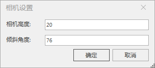
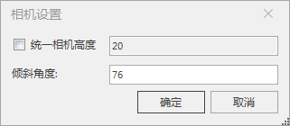

---
id: ConvertFlyRoute
title: 线转换飞行路线  
---  
### 使用说明

“ **飞行管理** ”选项卡中的“ **飞行路线** ”组，组织了与三维飞行有关的功能，可进行三维飞行路线的创建、转换、删除、站点管理等相关操作。

  * “ **由线转换** ”功能用来将线数据直接转换为飞行路线或者将线对象上的节点转换为站点。
  * 可转化成飞行路径的线数据分为二维线数据和三维线数据。二维线数据就是只含有 x 坐标和 y 坐标的二维线；三维线数据就是在二维线的基础上包含了 z 坐标（高度坐标）的三维线数据。
  * 当场景中存在选中的二维或三维线数据对象时，“ **飞行路线** ”组中的“ **由线转换** ”下拉按钮为可用状态。

### 操作步骤

  1. 单击“ **由线转换** ”下拉按钮。弹出下拉菜单，该下拉菜单提供了将选中线对象转换为一条飞行路径或将线对象的结点添加为飞行站点的功能。
  2. 当由二维数据进行飞行路径转换时:
      * **由线转换为路径** ：单击该项，弹出“相机设置”对话框，用户设置相机高度和倾斜角度等相关参数后，即可将选中线对象的结点转换为一条新的飞行路径，每一个节点将作为飞行路线上的站点。转换后的路径参数设置请参见[创建飞行路线](CreateRoute)中参数设置的相关内容。
      * **由线转换为站点** ：单击该项，弹出“相机设置”对话框，设置相机高度和倾斜角度等相关参数后，即可将选中线对象的节点添加为当前飞行路径中的站点。转换后的站点参数设置请参见[创建飞行路线](CreateRoute)中参数设置的相关内容。
      
  3. 当由三维数据进行飞行路径转换时：
      * 由线转换为路径：单击该项，弹出如下图所示的“相机设置”对话框，用户设置统一机高度和倾斜角度等相关参数后，即可将选中线对象的结点转换为一条新的飞行路径，每一个节点将作为飞行路线上的站点。请参见[创建飞行路线](CreateRoute)中参数设置的相关内容。
      * 由线转换为站点：单击该项，弹出如下图所示的“相机设置”对话框，设置统一相机高度和倾斜角度等相关参数后，即可将选中线对象的节点添加为当前飞行路径中的站点。请参见[创建飞行路线](CreateRoute)中参数设置的相关内容。
     
三维线转换相机设置对话框  
  
注意：三维线数据中的节点的 z 坐标值直接转化为飞行路径中对应站点的相机高度，若勾选“ **统一相机高度** ”复选框则重新为飞行路径统一赋值。

