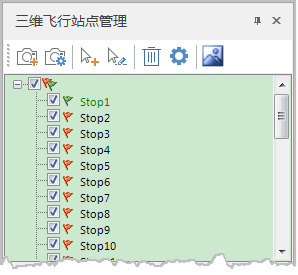
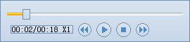

---
id: CreateRoute
title: 创建飞行路线  
---  
### 使用说明

“飞行管理”选项卡中的“飞行路线”组，组织了与三维飞行有关的功能，可进行三维飞行路线的创建、转换和删除、站点管理等相关操作。

### 操作步骤

1. 新建飞行路径 

单击“ **飞行路线** ”组的“ **新建** ”按钮，弹出“三维飞行站点管理”窗口（浮动窗口），同时创建一个三维飞行路径。
此时，在“三维飞行站点管理”窗口将出现一个飞行路径结点，一个飞行路径结点对应一条飞行路径。

飞行路径前的复选框用于控制当前路径是否有效。勾选状态时，当前路径有效；否则无效。

飞行路径结点对应的飞行路径名称可以修改。具体操作：单击选中该结点，按 F2
快捷键；或者单击右键菜单选择“重命名”，飞行路径结点名称变为可编辑状态，即可对飞行路径进行修改。

2. 添加或修改飞行站点 

添加或修改当前飞行路径的飞行站点，由这些控制点来确定飞行过程中的路线、观测角度。系统提供了以下几种方式：
  * “场景相机添加站点”按钮：单击“场景相机添加站点”按钮，即可根据场景当前相机所在位置，在飞行路线中添加一个新的观测站点。使用快捷键J，可向飞行路线中快速添加一个站点。
  * 改站点” 按钮：选中飞行路线中的一个飞行站点，然后单击“场景相机修改站点”按钮，即可将所选站点的位置修改为当前相机所在位置。
  * “鼠标拾取添加站点” 按钮：单击“鼠标拾取添加站点”按钮，即可在场景中浏览地球到适当的观测位置后单击鼠标设置站点，作为飞行路径中的一个飞行站点，可以在下面的参数设置栏修改其角度和位置。
  *“鼠标拾取修改站点”按钮：选中飞行路线中的一个飞行站点，然后单击“鼠标拾取修改站点”按钮，即可在场景窗口中的合适位置再次单击鼠标，修改所选站点的位置。
  *“删除”按钮：选中一个或多个站点后，单击“删除”按钮，即可删除所选站点；选中飞行路径结点后，单击“删除”按钮，即可删除整个飞行路线。
  * “飞行站点设置...”按钮：选中飞行路线或站点，单击“飞行站点设置...”按钮，可设置站点的转弯、暂停、旋转等参数，具体说明请参见[飞行路线和站点管理](FlyingStopManager)。
  * “平滑飞行路线”按钮：单击“平滑飞行路线”按钮，弹出“平滑飞行路线”对话框，可设置平滑系数和采样数。其中，平滑系数的取值范围为（0,1），值越大，飞行路线越平滑，但插入站点偏离原始轨迹程度越大。采样数是指原站点间插入的站点个数，如输入2，即在原始每两个站点之间插入2个站点。

如下图所示，当通过以上方式添加站点后，在“三维飞行站点管理”窗口中飞行路径结点下将自动增加一个或多个新的站点结点。   
  
  
  当飞行状态为暂停或者停止时，用户可以双击当前路径中任一站点对应的结点（或右键菜单选择“定位到”该点），场景自动定位到该站点，单击“飞行”按钮，将从该站点开始飞行至路径的最后一个站点。

  飞行站点前的复选框用于控制当前站点是否有效。勾选复选框时，当前站点有效；否则无效，即该站点不会在飞行路线中显示，飞行过程中该站点也会被排除。

  站点的显示名称可以修改。操作方式：单击选中站点结点，按 F2 快捷键或者单击右键菜单选择“重命名”，站点名称变为可编辑状态，此时就可以修改名称了。

3. 参数设置 

在“三维飞行站点管理”窗口中，选中飞行路径结点中的站点结点，在该窗口下部将显示选中站点的具体观测位置和角度的相关参数，同时也可修改这些参数改变站点的观测状态。若用户同时选中多个站点结点，则显示的参数为编号最靠前的站点的参数。

  * **经度、纬度、高度：** 用来显示和设置当前选中的站点的观测位置信息，包括观测站点的经纬度坐标和高程值。
  * **方位角：** 用来显示和设置当前选中站点的观测方位角。当添加一个站点时，系统会自动计算站点与下一站点的连线与正北方向的夹角，作为当前站点的观测方位角，即沿飞行路径方向。
  * **倾斜角度：** 用来显示和设置当前选中站点的观测倾斜角度。当添加一个站点时，系统会自动计算观测站点在垂直方向上的倾斜角度。
  * **使用站点速度：** 用于设置是否以站点速度飞行。勾选该复选框，表示飞行到该站点时，会忽略路线飞行速度，以设置的站点速度飞行，例如，线路速度为 100km/h，第三个站点设置的站点速度为 80km/h，则飞行到第三个站点时会以 80km/h 的速度进行飞行；否则，以路径速度飞行。
  * **速度：** 用来显示和设置从当前选中站点开始飞行到下一个观测站点时所使用的飞行速度，同时在标签右侧的下拉按钮中可设置飞行速度的单位。
  * **时长：** 用来显示和设置从当前选中站点开始飞行到下一个观测站点所用的飞行时间，同时在标签右侧的下拉按钮中可设置飞行时间的单位。

    注意：当飞行状态为停止状态时，用户既可以对单个站点进行站点速度和时长的设置，也可以同时对多个站点进行设置。速度和时长两个参数只设置一项即可，另一项的值会随之进行相应的换算。

4. 飞行路线风格设置 

    用于设置飞行路线的高度模式、底部高程、路线颜色、宽度等参数，其中高度模式支持设置为绝对高度、贴地两种模式。选中飞行路线，显示“飞行路线风格设置”区域。

5. 飞行控制 

    用来控制开始、暂停或停止飞行；同时，可单击“前进”、“后退”按钮，或者拖动飞行滑块来控制飞行情况，具体可参见[控制飞行过程](ControlFlying)。

  
6. 右键菜单 

“ **三维飞行站点管理**
”窗口的右键菜单，实现对站点的站点速度、站点飞行设置等功能。右键菜单的详细命令说明请参见：[飞行站点管理右键菜单](FlyingStopManager)。

