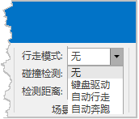

---
id: WalkingMode
title: 行走模式  
---  
### 使用说明

行走模式是指在室内或局部场景中模拟人的行走动作来浏览场景，可以实现人在平路行走、上下斜坡、上下楼梯的效果。提供了键盘驱动、自动行走、自动奔跑三种模式：   

  
---  
“行走模式”下拉选项  
  
  * **键盘驱动** ：该模式需通过键盘中的上、下、左、右或 W、S、A、D 方向键，控制人的行走方向，同时，可移动鼠标可改变浏览方向。
  * **自动行走** ：该模式下相机会模拟人的行走方式和速度自动浏览场景，通过移动鼠标改变人的行走方向即可。
  * **自动奔跑** ：该模式下相机会模拟人奔跑方式和速度自动浏览场景，通过移动鼠标改变人的奔跑方向即可。自动奔跑模式比自动行走模式的浏览速度要快。

开启行走模式后，通常会使用鼠标和键盘来浏览场景，相关操作说明如下：

  1. 在这三种模式下，鼠标的光标会隐藏，移动鼠标可以改变浏览的方向。
  2. 开启行走模式后，通过按键盘中的 1、2、3 可在键盘驱动、自动行走、自动奔跑之间进行模式切换，当用户按下“ESC”可以退出行走模式。
  3. 开启行走模式后，在浏览场景时，可按住鼠标右键上下移动鼠标，调整场景的俯仰角。
  4. 开启自动行走或自动奔跑模式后，或在键盘驱动模式下，按住↑或W键时，可通过鼠标中间的滚轮调节行走速度，往前滚动滚轮表示加速，往后滚动滚轮表示减速。
  5. 开启行走模式后，若相机角度与模型垂直，或相机行走到 ≤90°的角落时，相机会停止运动，调整行走方向后即可继续行走。

### 操作步骤

### 键盘驱动

  1. 新建或打开一个场景窗口后，添加需浏览的模型数据或其他数据至场景中。
  2. 在“ **飞行管理** ”选项卡“ **场景漫游** ”组中的“ **行走模式** ”下拉按钮中选择“键盘驱动模式”，开启键盘驱动模式。
  3. 按住键盘中的上、下、左、右或 W、S、A、D 方向键，可控制场景相机行走的方向。
  4. 同时，将鼠标移动到场景窗口中，左右移动鼠标可调整相机行走的方向。

### 操作步骤

### 自动行走

  1. 新建或打开一个场景窗口后，添加需浏览的模型数据或其他数据至场景中。
  2. 在“ **飞行管理** ”选项卡“ **场景漫游** ”组中的“ **行走模式** ”下拉按钮中选择“自动行走”项，开启自动行走模式。
  3. 此时，场景会模拟人的行走速度自动浏览场景，将鼠标移动到场景窗口中，左右移动鼠标可调整相机行走的方向。

### 操作步骤

### 自动奔跑

  1. 新建或打开一个场景窗口后，添加需浏览的模型数据或其他数据至场景中。
  2. 在“ **飞行管理** ”选项卡“ **场景漫游** ”组中的“ **行走模式** ”下拉按钮中选择“自动奔跑”项，开启自动奔跑模式。
  3. 此时，场景会模拟人的奔跑速度自动浏览场景，将鼠标移动到场景窗口中，左右移动鼠标可调整相机行走的方向。

