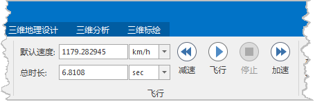

**使用说明**

“ **飞行管理** ”选项卡的“ **飞行** ”组，组织了三维飞行路径的速度和时长的设置、控制开始或停止飞行等功能。  
  
  
  1. 速度和时长 
       * **默认速度：** 用来显示和设置当前选中路径的飞行速度，同时在标签右侧的下拉按钮中可设置飞行速度的单位。
       * **总时长：** 用来显示和设置当前选中路径的总飞行时间，同时在标签右侧的下拉按钮中可设置飞行时间的单位。  
    注意：默认速度和总时长这两个参数只设置其中一项即可，另一项的值会随之进行相应的换算。

  2. 飞行 
       *  按钮：设置好飞行路径后，就可以进行飞行了。单击“飞行”组中的  “飞行”按钮，开始飞行。此时，“飞行”按钮变为  状态。   
 如果在“三维飞行站点管理”窗口中选中了某个站点结点，则飞行时，将从该站点开始飞行到飞行路径的最后一个站点；  
如果在“三维飞行站点管理”窗口中选中了某个飞行路径结点，则飞行时，将从该飞行路线的第一个站点开始飞行到飞行路径的最后一个站点。　　
      *  按钮：单击“飞行”组中的 “暂停”按钮，暂时停止当前飞行（键盘空格键 Space 同此功能）。如果再次单击  “飞行”按钮，则继续飞行。
      *  按钮：单击“飞行”组中的 “停止”按钮，停止飞行。
      *  按钮：单击“飞行”组中的 “加速”按钮，为当前飞行速度加速。当前飞行速度大于默认速度（>或=1X）时，每单击一次“加速”按钮，飞行速度以1X的速率增加。当前飞行速度小于默认速度（<1X）时，每单击一次“加速”按钮，飞行速度以0.1X的速率增加。速度最大可加速至100X。在飞行过程中，使用 Ctrl + + 可以实现加速操作。
      *  按钮：单击“飞行”组中的 “减速”按钮，为当前飞行速度减速。当前飞行速度大于默认速度（>1X）时，每单击一次“减速”按钮，飞行速度以1X的速率递减。当前飞行速度小于默认速度（<1X）时，每单击一次“减速”按钮，飞行速度以0.1X的速率递减。速度最大可减速至0.1X。在飞行过程中，使用 Ctrl + - 可以实现减速操作。

 

