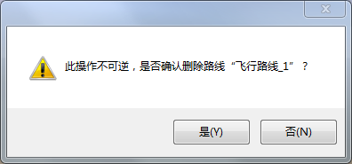

**使用说明**

“ **飞行管理** ”选项卡中的“ **飞行路线** ”组，组织了与三维飞行有关的功能，可进行三维飞行路线的创建、删除、站点管理等相关操作。

**操作步骤**

  1. 在当前场景中，单击“ **飞行管理** ”组的“ **删除** ”按钮，弹出提示对话框，如下图所示：  
  

  2. 删除飞行路径文件的操作是不可逆的，需要慎重。单击"是"按钮，确定删除；如果需要取消删除操作，请单击"否"按钮。

 

