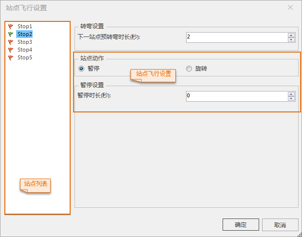

### 飞行路线结点右键菜单

  1. 右键单击飞行路线结点，弹出右键菜单窗口。
  2. **重命名** ：选择右键菜单的“重命名”，飞行路线名称变为可编辑状态，输入新的名字即可。
  3. **站点飞行设置** ：选择右键菜单中的“站点飞行设置”，弹出“站点飞行设置”对话框，用户可以在站点列表中选择站点进行设置。  
  

      * **站点列表** ：左侧为站点列表，列出了当前飞行路线的所有的站点。
      * “ **下一站点预转弯时长** ”（简称转弯时长）表示从当前站点飞行至下一站点前的“转弯时长”的时间内开始转弯。如果设置的“转弯时长”比实际的当前站点至下一站点的飞行时间长，表示从当前站点飞行时即开始转弯。用户可以直接输入“转弯时长”，也可以单击右侧按钮进行微调，“转弯时长”以秒为单位，默认为2秒。 
      * **站点飞行设置** ：应用程序提供了两种互斥的站点动作：暂停和旋转。
        * 当选择“暂停”模式时，下面显示暂停飞行设置相关的参数。“暂停时长”结束后，继续飞行。用户可以直接输入要暂停的时间长度，也可以单击右键的按钮进行微调，“暂停时长”以秒为单位，默认为0秒。 
        * 当选择“旋转”模式时，对话框下方显示“旋转设置”相关参数。在“旋转设置”信息列表中列出了绕站点飞行信息，包括观测站的高度、方位角、倾斜角度，以及从观测站点的当前方向旋转到下一方向的旋转方向。应用程序会按列表中先后顺序，按指定的旋转方向等信息旋转到下一条绕站点飞行信息，直到结束（观测站点的最后一个旋转方向无效）。单击选中高度、俯角或水平角区域，再次单击，区域会变为可编辑状态，可输入指定的信息；单击“旋转方向”下拉按钮选择逆时针或顺时针；列表上的“添加”，“删除”，“全选”，“反选”，“置顶”，“上移”，“下移”、“置底”按钮来对每一条观测站点信息进行先后顺序调整；列表下的“水平角速度”编辑框用来设置旋转时的水平角角速度，以度/秒为单位。   
**注意** ：最后一个站点不支持旋转设置。  
  

  

### 站点结点右键菜单

  1. 右键单击飞行路径结点下的站点结点，弹出右键菜单窗口。 
       * **飞行** ：执行已设置的这条飞行路线。
       * **定位到** ：定位到当前选中的飞行站点。
       * **全选** ：全部选中当前飞行路径下的观测站点。在飞行路线停止的时候，"全选"功能可用。
       * **反选** ：将当前选中的观测站点设为非选中状态，将非选中状态的观测站点设为选中状态。在飞行路线停止的时候，"反选"功能可用。
       * **取消站点速度** ：取消从当前选中站点开始飞行到下一个观测站点时所使用的飞行速度的设置。如何设置飞行速度请参见：[控制飞行过程](ControlFlying  )。
       * **站点飞行设置** ：选择右键菜单中的“站点飞行设置”，弹出“站点飞行设置”对话框，可设置站点的暂停或旋转飞行，具体操作见上。
       * **重命名** ：选择右键菜单的“重命名”，当前站点名称变为可编辑状态，输入新的名字即可；当选中多个观测站点时，“重命名”功能无效。
       * **删除** ：用于删除当前选中的观测站点。

 

