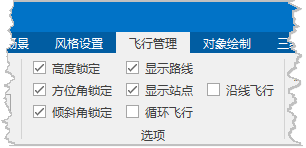

“飞行管理”选项卡的“选项”组，组织了与三维飞行的各种参数设置的相关控件。  
  
  
  * **高度锁定**

勾选该复选框后，飞行执行过程中，观测的高度由各个观测站点的观测高度决定，飞行过程中不能改变； 
取消该复选框的选中状态后，飞行执行过程中，观测的高度可以通过键盘操作随时改变，即通过 PageUp 和 PageDown 键来改变观测高度。

  * **方位角锁定**

勾选该复选框后，飞行执行过程中，观测的方位角根据飞行路径中各个观测站点的方位角插值获得，飞行过程中不能改变；

取消该复选框的选中状态后，飞行执行过程中，观测的方位角可以通过键盘操作随时调整，即通过 Shift + A 和 Shift + D
键来改变观测方位角。注意：快捷键仅在飞行暂停时有效。

  * **倾斜角锁定**

勾选该复选框后，飞行执行过程中，观测的倾斜角根据飞行路径中各个观测站点的倾斜角插值获得，飞行过程中不能改变；

取消该复选框的选中状态后，飞行执行过程中，观测的倾斜角可以通过键盘操作随时调整，即通过 Shift + W 和 Shift + S
键来改变观测倾斜角。注意：快捷键仅在飞行暂停时有效。

  * **显示路线**

勾选该复选框后， 场景中将显示所设置的飞行路径，即连接飞行站点间的线；否则，不显示。

  * **显示站点**

勾选该复选框后， 场景中将显示所设置的飞行站点；否则，不显示。

  * **循环飞行**

勾选该复选框后，在执行三维飞行时，将重复执行飞行路线的飞行操作，直到用户停止飞行；如果该复选框没有被选中，则执行飞行操作时，只能飞行一次飞行路线。

  * **沿线飞行**

勾选该复选框后，系统会计算当前飞行路径的视角信息，并按计算得到的视角信息进行站点观测；否则按“三维飞行站点管理”中各默认生成的观测站点的方位角进行观测。

 

