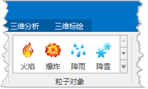

---
id: GeoParticleSetting
title: 粒子对象的创建  
---  
### 使用说明

粒子对象是一种在三维场景中进行应用的三维几何对象。使用 SuperMap
粒子对象可以方便的模拟出火焰、爆炸、烟雾、喷泉、降雨、降雪或者像发光轨迹这样的抽象视觉效果等等。

### 操作步骤

  1. 新建一个场景窗口，同时将一个 CAD 数据集或KML文件添加到该场景中，将 CAD 数据集或KML图层处于可编辑状态，此时激活对象绘制选项卡。
  2. 在“ **对象绘制** ”选项卡的“ **粒子对象** ”组中，选择将要应用的粒子对象类型，在 CAD 图层或KML图层的合适位置单击鼠标，绘制粒子对象。粒子特效是在三维场景中使用的特殊几何对象，绘制方式与三维对象绘制方式一致。三维对象的绘制方法，请参见[创建三维对象](../DataProcessing/Create3DGeometry)。     
     
  
  
成功创建的粒子对象被赋予系统默认参数，用户可根据实际需求更改粒子对象的相关参数，详细操作参见[粒子对象管理窗口](GeoParticleSettingManage)。

