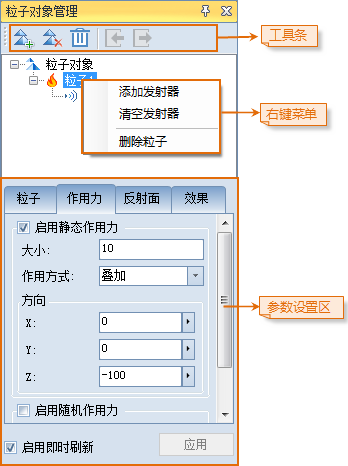
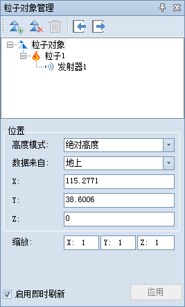
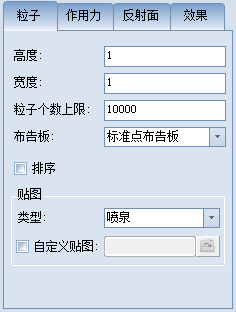
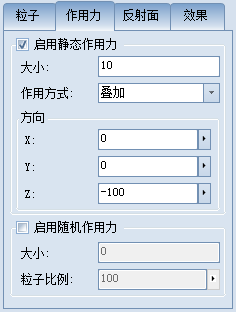
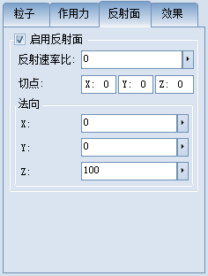
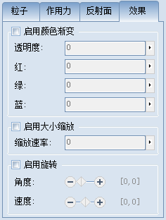
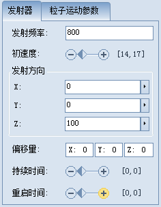
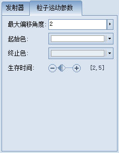

在当前场景窗口中选中任一粒子对象，激活"粒子对象管理"窗口。如下图所示，其操作区域主要分为三大部分，分别为工具条，右键菜单，参数设置区。  
  

###  粒子对象管理窗口工具条

粒子对象管理窗口工具条提供了五个功能按钮，针对不同层级的三维几何对象。

  * **添加子对象** ：单击  按钮，向该层级对象添加子对象，发射器层级不支持添加子对象。
  * **清空子对象** ：单击  按钮，移除该层级对象的所有子对象，发射器层级不支持清空子对象。
  * **移除** ：单击  按钮，移除该层级对象及其所有子对象，粒子对象层级不可移除。
  * **导入粒子对象** ：选中粒子对象层级，单击  按钮，弹出"打开"对话框，查找、定位要导入的三维粒子资源文件，该资源文件为*.par 格式（即 XML 文件），记录了三维粒子几何对象及其持有的粒子系统对象的各参数值，单击"打开"即可。 
  * **导出粒子对象** ：选中粒子对象层级，单击  按钮，弹出"另存为"对话框，选择要导出的三维粒子资源文件的存储位置，该资源文件为*.par 格式（即 XML 文件），记录了三维粒子几何对象及其持有的粒子系统对象的各参数值，输入新粒子资源文件的文件名，单击"保存"即可。 

###  粒子对象管理窗口中右键菜单

在粒子对象管理窗口中，为方便用户管理场景中所有的三维粒子几何对象，SuperMap 的粒子对象及其子对象提供了右键菜单功能，  
粒子对象的右键菜单

  * **定位到** ：快速定位到所选中的粒子对象，并在当前场景窗口中居中显示。
  * **添加粒子** ：向该粒子对象中添加一个粒子。
  * **清空粒子** ：移除该粒子对象中所有的粒子。
  * **导入粒子对象** ：弹出“打开”对话框，查找、定位要导入的三维粒子资源文件，该资源文件为*.par 格式（即 XML 文件），记录了三维粒子几何对象及其持有的粒子系统对象的各参数值，单击"打开"即可。 
  * **导出粒子对象** ：弹出“另存为”对话框，选择要导出的三维粒子资源文件的存储位置，该资源文件为*.par 格式（即 XML 文件），记录了三维粒子几何对象及其持有的粒子系统对象的各参数值，输入新粒子资源文件的文件名，单击“保存”即可。 

粒子的右键菜单

  * **添加发射器** ：向粒子系统中添加一个粒子发射器。
  * **清空发射器** ：移除粒子系统中所有的粒子发射器。
  * **删除粒子** ：移除该粒子。

发射器的右键菜单

  * **删除发射器** ：移除该粒子发射器。

###  粒子对象管理窗口参数说明

在粒子对象管理窗口中 SuperMap 的粒子对象主要分为三层结构，分别是粒子对象的参数，粒子（粒子系统）的参数及发射器的参数三层。

  1. 在创建的粒子对象上单击鼠标右键，在弹出的右键菜单中选中“属性”项，激活“粒子对象管理”窗口。选中树形结构中 **粒子对象** 根节点层级后，就可以对粒子对象层参数进行编辑。      
       * **位置** ： 
         * **高度模式** ：设置粒子对象使用的高度模式，有关高度模式，请参见:[关于高度模式](../AdvancedLayserSetting/AboutAltitudeMode  )的详细介绍。
         * **数据来自** ：选择数据的来源，为地上数据或者地下数据。其中地下数据，用于显示地下场景效果。
         * **X,Y,Z坐标** ：粒子对象位置的三维坐标值。X 和 Y 经纬度坐标值不能超过±180。
       * **缩放** ：分别设置沿（X、Y、Z）轴放大或缩小的比例。
  2. 粒子（粒子系统）层结构参数的编辑，选中树形结构中 **粒子** 根节点层级，可以对粒子对象层参数进行编辑。    
               
 
粒子  
  * **单个粒子高度和宽度** ：可以通过设置粒子贴图的“ **高度** ”和“ **宽度** ”的尺寸大小调整每个粒子的大小。
  * **粒子个数上限** ：当前粒子系统中粒子个数的上限值。当粒子系统在场景中存在的粒子数目超过设置的上限时，发射器将停止发射粒子，直到一部分粒子生命周期结束数后数目低于上限时才会继续发射。
  * **布告板** ：类似于一个面对像用来承载单个粒子的纹理贴图，可以选择该面对象朝向摄像机的方式。共有三种方式: 
  * 标准点布告板：此时粒子总是能完全朝向相机。
  * 公共方向旋转布告板：此时粒子以一个公共方向为轴旋转，来尽量朝向相机。
  * Y 轴旋转布告板：此时粒子总是绕着它们自身的 Y 轴旋转，来尽量朝向相机。
  * **排序** ：勾选排序功能可以使得粒子特效的显示优先渲染离摄像机位置近的粒子，从而使得效果更佳合理（会占用少部分资源）。
  * **贴图** ：包括“类型选择”和“自定义贴图”两种获取贴图的方式。用户可以在“类型”右侧的下拉列表中选择系统提供的几种特效常用的纹理贴图，也可以勾选“自定义贴图”项，自行绘制贴图，以进行特效编辑。   
提供的粒子贴图目前支持的格式有：*.png，*.tga，*.dds，*.tif，*.jpg（在透明贴图使用的时候黑色显示为透明效果）。  

　　作用力 
* **启用静态作用力** ：开始静态作用力功能。 
  * 大小：设置静态作用力的大小。
  * 作用方式：叠加方式和平均方式。
  * 方向：根据 X、Y、Z 坐标设置作用力方向。
* **启用随机作用力** ：开启随机作用力功能。 
  * 大小：设置静态作用力的大小。
  * 粒子比例：受影响的粒子的比例。

反射面

  * **启用反射面** ：实现粒子在某一位置呈现反射效果。 
    * 反射速率比：设置受反射效果影响的粒子反射时的速率比，反射速率比 = 粒子被反射后速率/反射前速率。
    * 切点：通过一个点和反射面的法向，可以确定一个位置唯一的反射面；该点的位置我们称之为 **切点** ，设置切点的坐标位置（坐标系采用的是相对粒子对象的局部坐标系）。
    * 法向：即为反射面法线的方向（反射面的法线：始终垂直于反射面的虚线），通过 X、Y、Z 方向确定法向方向。

效果

  * **启用颜色渐变** ：开启颜色渐变效果，改变粒子发射后变化的颜色。 
    * 透明度：粒子发出后透明度可以随时间（每秒）有一定的变化量，用户可以通过该参数控制粒子透明度的每秒变化量。透明度的取值范围为[-100,100]。
    * 颜色红、绿、蓝：用户可以分别控制粒子每秒钟颜色渐变的变化量。每个颜色分量的取值范围为[-100,100]。值越大，表示渐变的时候，越接近该颜色分量。
  * **启用大小缩放** ：开启粒子大小缩放效果。 
    * 缩放速率：参数设置每秒钟粒子的缩放比率。
  * **启用旋转** ：开启旋转效果。 
    * 角度：粒子旋转角度会在最小值和最大值之间随机分布，单位为：角度，取值范围为0到360。既可以直接拖动双滑块的最小/最大滑块设置旋转角度，也可以单击滑块后的数字，在弹出的文本框中输入数值。 
    * 速度：粒子旋转速度会在最小值和最大值之间随机分布，单位为：角度/秒，取值范围为-360到360。既可以直接拖动双滑块的最小/最大滑块设置旋转速度，也可以单击滑块后的数字，在弹出的文本框中输入数值。 

  3. 粒子发射器层结构的参数编辑。    
       

  
发射器

 * **发射频率** ：单位时间内发射的粒子个数。对于点粒子（火焰、爆炸等），发射频率控制在[0，2000]；对于雨雪面粒子，发射频率控制在[0,5000]。
 * **初速度** ：设置粒子发射的最小和最大初速度范围。既可以直接拖动双滑块的最小/最大滑块设置初速度，也可以单击滑块后的数字，在弹出的文本框中输入数值。
 * **发射方向** ：分别由 X、Y、Z 坐标轴确定粒子的最终发射方向。
 * **发射器偏移量** ：通过设置X、Y、Z 坐标偏移量调整发射器最终在粒子对象中的相对原点的偏移量。
 * **持续时间** ：设置发射器最短和最长存在时间，单位为秒，取值范围为0到20。既可以直接拖动双滑块的最小/最大滑块设置时间，也可以单击滑块后的数字，在弹出的文本框中输入数值。
 * **重启时间** ：设置发射器最小和最大重复启动时间。既可以直接拖动双滑块的最小/最大滑块设置时间，也可以单击滑块后的数字，在弹出的文本框中输入数值。

粒子运动参数

  * **最大偏移角度** ：粒子发射后偏移发射方向的角度。
  * **起始色** ：设置粒子发射初的颜色。
  * **终止色** ：设置粒子结束时的颜色。
  * **生存时间** ：设置粒子的最小和最大随机生存时间。既可以直接拖动双滑块的最小/最大滑块设置时间，也可以单击滑块后的数字，在弹出的文本框中输入数值。

  4. 启用即时刷新和应用：单击 **应用** 将改变的粒子属性参数赋值给粒子对象并显示效果。勾选 **启用即时刷新** 场景中的粒子对象会实时更新改变的参数。

 

