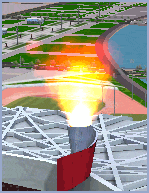
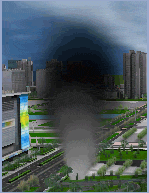
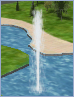
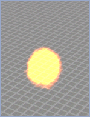
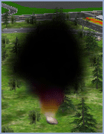
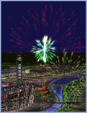
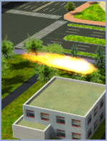
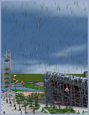
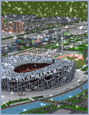

以下是粒子特效实例的部分参数值和效果对照 。  
表中没有列出的参数粒子对象取默认值0，具体各项参数可参照[粒子对象创建](GeoParticleSetting)文档。

<table class="normaltable" width="85%">
      <thead>
        <tr class="normaltableTitle">
          <td width="10%">效果类型</td>
          <td width="20%">粒子对象参数（单位：米）</td>
          <td width="28%">粒子系统及影响其参数（单位：米）</td>
          <td width="22%">发射器参数（单位：个/秒）</td>
          <td width="15%">效果</td>
        </tr>
      </thead>
      <tr class="normaltablecontent2">
        <td>火焰</td>
        <td>
<b>高度模式</b>：绝对高度

          
<b>位置</b>：（X，Y，Z)随机取值

          
<b>缩放</b>：(X：1，Y：1，Z：1)
</td>
        <td>
<b>粒子高度</b>：5

          
<b>粒子宽度</b>：6

          
<b>布告板模式</b>：标准点布告板

          
<b>其他影响器作用</b>：默认状态是关闭的
</td>
        <td>
<b>发射频率</b>：220个/秒

          
<b>初速度</b>：12～14米/秒

          
<b>发射方向</b>：（X：0，Y：0，Z：1）

          
<b>最大偏移角度</b>：33

          
<b>起始色</b>：RGB 值（255,102,0）

          
<b>终止色</b>：RGB 值（255,255,255）

          
<b>生存时间</b>：1～2秒
</td>
        <td></td>
      </tr>
      <tr class="normaltablecontent1">
        <td>烟雾</td>
        <td>
<b>高度模式</b>：绝对高度

          
<b>位置</b>：（X，Y，Z)随机取值

          
<b>缩放</b>：(X：1， Y：1， Z：1)
</td>
        <td>
<b>粒子高度</b>：10

          
<b>粒子宽度</b>：10

          
<b>布告板模式</b>：标准点布告板

          
<b>启用颜色渐变</b>：Alpha 值=-12，RGB 值（-12，-12，-12）

          
<b>启用大小缩放率：</b>5

          
<b>其他影响器作用</b>：默认状态是关闭的
</td>
        <td>
<b>发射频率</b>：7个/秒

          
<b>初速度</b>：8～10米/秒

          
<b>发射方向</b>：（X：0，Y：0，Z：1）

          
<b>最大偏移角度</b>：20

          
<b>起始色</b>：RGB 值（163,163,163）

          
<b>终止色</b>：RGB 值（163,163,163）

          
<b>生存时间</b>：12～20秒
</td>
        <td>&nbsp;&nbsp;</td>
      </tr>
      <tr class="normaltablecontent2">
        <td>喷泉</td>
        <td>
<b>高度模式</b>：绝对高度

          
<b>位置</b>：（X，Y，Z)随机取值

          
<b>缩放</b>：(X：1， Y：1， Z：1)
</td>
        <td>
<b>粒子高度</b>：1

          
<b>粒子宽度</b>：1

          
<b>布告板模式</b>：标准点布告板

          
<b>启用静态作用力</b>：大小：10，作用方式：叠加，作用方向：（X：0，Y：0，Z：-1）

          
<b>启用反射面：</b>反射率：10，放射方向：（X：0，Y：0，Z：1）

          
<b>其他影响器作用</b>：默认状态是关闭的
</td>
        <td>
<b>发射频率</b>：800个/秒

          
<b>初速度</b>：14～17米/秒

          
<b>发射方向</b>：（X：0，Y：0，Z：1）

          
<b>最大偏移角度</b>：2

          
<b>起始色</b>：RGB 值（255,255,255）

          
<b>终止色</b>：RGB 值（232,239,244）

          
<b>生存时间</b>：2～5秒
</td>
        <td>&nbsp;&nbsp;</td>
      </tr>
      <tr class="normaltablecontent1">
        <td>爆炸</td>
        <td>
<b>高度模式</b>：绝对高度

          
<b>位置</b>：（X，Y，Z)随机取值

          
<b>缩放</b>：(X：1，Y：1，Z：1)
</td>
        <td>
<b>粒子高度</b>：15

          
<b>粒子宽度</b>：15

          
<b>布告板模式</b>：标准点布告板

          
<b>启用颜色渐变</b>：Alpha 值=-37，RGB 值（-15，-15，-15）

          
<b>其他影响器作用</b>：默认状态是关闭的
</td>
        <td>
<b>发射频率</b>：2000个/秒

          
<b>初速度</b>：18～18米/秒

          
<b>发射方向</b>：（X：0，Y：0，Z：1） 

          
<b>最大偏移角度</b>：90

          
<b>起始色</b>：RGB 值（255,150,0）

          
<b>终止色</b>：RGB 值（255,150,0）

          
<b>生存时间</b>：0.3～1.5秒

          
<b>持续时间</b>：0.2～0.2秒

          
<b>重启时间</b>：0.1～3秒
</td>
        <td>&nbsp;&nbsp;</td>
      </tr>
      <tr class="normaltablecontent2">
        <td>烟火</td>
        <td>
<b>高度模式</b>：绝对高度

          
<b>位置</b>：（X，Y，Z)随机取值

          
<b>缩放</b>：(X：1， Y：1， Z：1)
</td>
        <td>
<b>粒子高度</b>：11

          
<b>粒子宽度</b>：11

          
<b>布告板模式</b>：标准点布告板

          
<b>启用颜色渐变</b>：Alpha 值=0，RGB 值（-50，-70，-50）

          
<b>启用大小缩放</b>：20

          
<b>其他影响器作用</b>：默认状态是关闭的
</td>
        <td>
<b>发射频率</b>：53个/秒

          
<b>初速度</b>：21～31米/秒

          
<b>发射方向</b>：（X：0，Y：0，Z：1）

          
<b>最大偏移角度</b>：24

          
<b>起始色</b>：RGB 值（204,204,0）

          
<b>终止色</b>：RGB值（204,204,255）

        
<b>生存时间</b>：3～3秒
</td>
        <td>&nbsp;&nbsp;</td>
      </tr>
      <tr class="normaltablecontent1">
        <td>烟花</td>
        <td>
<b>高度模式</b>：绝对高度

          
<b>位置</b>：（X，Y，Z)随机取值

          
<b>缩放</b>：(X：1， Y：1， Z：1)
</td>
        <td>
<b>粒子高度</b>：55 

          
<b>粒子宽度</b>：22

          
<b>布告板模式</b>：Y轴旋转布告板

          
<b>启用颜色渐变</b>：Alpha 值=0，RGB 值（-50，-50，-50）

        
<b>其他影响器作用</b>：默认状态是关闭的
</td>
        <td>
<strong>多发射器</strong>

          
<b>发射频率</b>：1000个/秒

          
<b>初速度</b>：80～150米/秒

          
<b>发射方向</b>：（X：0，Y：0，Z：-1）

          
<b>最大偏移角度</b>：180

          
<b>起始色</b>：RGB 值（255,0,0）

          
<b>终止色</b>：RGB 值（255,0,255）

          
<b>生存时间</b>：1.5～1.5秒

          
<b>持续时间</b>：0.1～0.1秒

        
<b>重启时间</b>：2～2秒
</td>
        <td>&nbsp;&nbsp;</td>
      </tr>
      <tr class="normaltablecontent2">
        <td>尾焰</td>
        <td>
<b>高度模式</b>：绝对高度

          
<b>位置</b>：（X，Y，Z)随机取值

          
<b>缩放</b>：(X：1， Y：1， Z：1)
</td>
        <td>
<b>粒子高度</b>：8

          
<b>粒子宽度</b>：8

          
<b>布告板模式</b>：Y&nbsp;轴旋转布告板

          
<strong>启用静态作用力</strong>：大小，10；作用方式，叠加

          
<strong>启用颜色渐变</strong>：透明度，0；红，-50；绿，-50；蓝，-50

        
<b>其他影响器作用</b>：默认状态是关闭的
</td>
        <td>
<b>发射频率</b>：600个/秒

          
<b>初速度</b>：20～80米/秒

          
<b>发射方向</b>：（X：0，Y：-100，Z：0）

          
<b>最大偏移角度</b>：1

          
<b>起始色</b>：RGB 值（255,102,0）

          
<b>终止色</b>：RGB 值（255,255,255）

        
<b>生存时间</b>：0.1～0.3秒
</td>
        <td>&nbsp;&nbsp;</td>
      </tr>
       <tr class="normaltablecontent1">
        <td>降雨</td>
        <td>
<b>高度模式</b>：绝对高度

          
<b>位置</b>：（X，Y，Z)随机取值

          
<b>缩放</b>：(X：1， Y：1， Z：1)
</td>
        <td>
<b>粒子高度</b>：30

          
<b>粒子宽度</b>：20

          
<b>布告板模式</b>：Y&nbsp;轴旋转布告板

          
<strong>启动随机作用力</strong>：大小，100；粒子比例，100

        
<b>其他影响器作用</b>：默认状态是关闭的
</td>
        <td>
<b>发射频率</b>：2000个/秒

          
<b>初速度</b>：300～300米/秒

          
<b>发射方向</b>：（X：20，Y：20，Z：-100）

          
<b>起始色</b>：RGB 值（255,255,255）

          
<b>终止色</b>：RGB 值（255,255,255）

        
<b>生存时间</b>：5秒
</td>
        <td>&nbsp;&nbsp;</td>
      </tr>
      <tr class="normaltablecontent2">
        <td>降雪</td>
        <td>
<b>高度模式</b>：绝对高度

          
<b>位置</b>：（X，Y，Z)随机取值

          
<b>缩放</b>：(X：1， Y：1， Z：1)
</td>
          <td>
<b>粒子高度</b>：20

            
<b>粒子宽度</b>：20

            
<b>布告板模式</b>：Y&nbsp;轴旋转布告板

            
<strong>启用随机作用力</strong>：大小，200；粒子比例，100

          
<b>其他影响器作用</b>：默认状态是关闭的
</td>
     <td>
<b>发射频率</b>：1000个/秒

       
<b>初速度</b>：150～150米/秒

       
<b>发射方向</b>：（X：0，Y：0，Z：-100）

       
<b>起始色</b>：RGB 值（255,255,255）

       
<b>终止色</b>：RGB 值（255,255,255）

       
<b>生存时间</b>：6秒
</td>
        <td>&nbsp;&nbsp;</td>
      </tr>
</table></td>
  </tr>
</table>

  
**相关主题**

 [粒子对象的创建](GeoParticleSetting)

 

