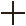
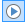
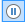
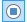
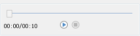
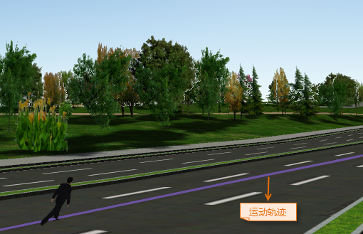

**使用说明**  
　　“添加轨迹模型”功能用于添加第三方模型数据到指定的 KML图层中，可通过绘制或选择一条路线，动态演示模型沿指定轨迹运动的过程。可加载到场景中的第三方数据模型的格式为：s3m、sgm、3ds、mesh、obj、dae、x、osg、osgb、stl、off。

**操作步骤**

  1. 新建或打开一个场景窗口后，需在指定的 KML 图层中添加轨迹模型，可通过以下三种方式添加：  
 - **方式一** ：在“ **对象绘制** ”选项卡“ **模型对象** ”组中，单击“ **轨迹模型** ”选项，弹出“打开三维模型文件”对话框。
     - 若当前场景中已添加了 KML/KMZ 图层，确保KML/KMZ图层处于可编辑状态。
     - 若当前场景中未添加 KML/KMZ 图层，可在“图层管理器”下普通图层的集合结点单击右键，在弹出的菜单内选择"新建KML图层"或"添加KML图层"选项进行新建或添加KML/KMZ图层；也可在“ **对象绘制** ”选项卡的“ **图层** ”组中选择“ **加载KML** ”或“ **新建KML** ”选项进行新建或添加KML/KMZ图层。
     - 在“打开三维模型数据文件”对话框中选择要添加第三方数据模型文件，然后单击对话框中的“打开”按钮即可将所选的数据模型添加到指定三维图层，单击“取消”按钮，即可取消操作。  
     - 
  - **方式二**：若场景中已添加KML图层，可在图层管理器中单击KML图层右键，选择“添加”菜单中的“轨迹模型...”项，弹出“打开三维模型文件”对话框，直接选择模型文件即可。
  - **方式三**：在场景中添加了KML图层之后，在“图层管理器”中选中KML图层中的某一个对象，单击鼠标右键，选择“属性”项，在弹出的“KML对象属性”面板中选择“轨迹管理”。
  
  2. 此时，将鼠标移至场景中，鼠标状态为  时，可在场景中绘制一条线作为运动轨迹。
  3. 添加轨迹模型后，应用程序会自动弹出“KML对象属性”面板，面板的“轨迹管理”处提供轨迹与动画播放的相关设置。
  4. “轨迹管理”面板中的工具栏提供了轨迹绘制、选择、可见、删除的相关操作，具体说明如下： 
     - **绘制轨迹** ：单击工具栏中的按钮，将鼠标移至场景中即可绘制一条折线，作为模型运动轨迹。
     - **选择轨迹** ：单击工具栏中的按钮，在场景中选择一条三维线作为模型运动轨迹。
     - **显示轨迹** ：单击工具栏中的按钮，当图标状态变为时，运动轨迹即可在场景中显示。
     - **删除轨迹** ：单击工具栏中的按钮，可将图层管理器中选中模型的运动轨迹删除。
     - **保存轨迹** ：单击工具栏中的按钮，弹出“保存轨迹”对话框，可将模型的轨迹以线对象的形式保存到指定的 KML 图层中。
  5. “轨迹信息”处用于显示模型是否创建轨迹和运动轨迹的距离，距离单位为米。
  6. “模型”处提供了演示模型的两种设置方式，分别为选择预设和自定义两种： 
     - 模型：当不勾选“自定义”复选框时，可单击组合框右侧的下拉按钮，选择程序预设的模型用于演示沿轨迹运动的过程。程序预设的模型有男生、女士、汽车三种。
     - 自定义：勾选“自定义”前方的复选框，单击右侧的按钮，在弹出的“打开三维模型文件”对话框中选择模型文件，或者在文本框中直接输入模型文件所在路径及文件名即可。
  7. “播放设置”处提供了动画的播放时长、速度、循环播放等设置，具体的操作说明如下： 
     - **时长** ：用于显示和设置节点动画的播放时间，单位为：秒，默认时长为 10 秒。
     - **速度** ：用来显示和设置模型从轨迹起点到终点的运动速度，单位为：m/s。
     - **循环播放** ：勾选该复选框后，在执行轨迹运动播放时，将重复执行播放操作，直到用户停止播放；若未选中该复选框，则执行播放操作时，播放完一次后就会停止播放。
  8. 面板最下方提供了播放控件，可用来控制开始、暂停或停止播放： 
     - “ **开始/暂停** ”按钮：单击按钮，即可按设定的时间或日期播放太阳光照效果；单击按钮，可暂停播放。
     - “ **停止** ”按钮：单击按钮，即可停止播放太阳光照，且场景中太阳光照效果会切换至开始时间的状态。  
  

  9. 节点动画的播放效果如下所示：  
    

**注意事项**

  1. 若通过在场景中绘制线方式添加轨迹，则默认不显示轨迹，需单击“轨迹管理”中的“轨迹可见”按钮将其设置为可见。
  2. 若通过方法三添加三维最佳路径结果保存的结果模型数据，需先将 KML/KMZ 图层设置为可编辑状态，在图层管理器中选中模型对象后，即可在“轨迹管理”面板中将轨迹设置为可见，随后即可动态演示模型沿轨迹运动的过程。

  

