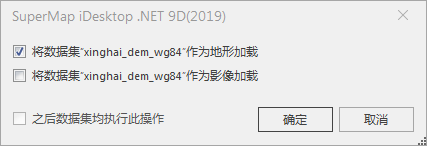
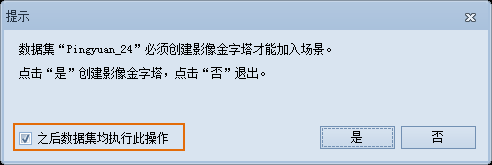

**使用说明**  
　　“场景”选项卡上的“数据”组，组织了向场景中添加各种数据的功能。  
　　可添加到场景中显示的数据有多种，包括二维的矢量数据集、影像数据集、栅格数据集、影像数据、地形数据、三维模型、KML数据和图片。目前，支持添加到场景中的矢量数据集包括：点、线、面、文本数据集、网络数据集和路由数据集。  
　　向场景中添加二维矢量数据集、影像数据集、栅格数据集，只需将工作空间管理器中相应的数据集拖放到场景即可。而向场景中添加其他类型的数据，需要通过“数据”组中的相应按钮来完成。

**注意** ：  

  * 栅格数据集可作为地形数据或影像数据加载至场景，向场景中添加一个或多个栅格数据集时，会弹出下图所示的对话框，用户可在复选框中勾选加载方式。同时加载多个栅格数据集时，若用户勾选了“之后数据集均执行此操作”，则此时添加的所有栅格数据集都按用户所勾选的方式加载至场景中。  
    
  * 若向场景中添加的影像数据太大，会弹出下图所示“提示”对话框，需创建影像金字塔才能将其加载。同时加载多个影像数据集时，若用户勾选了“之后数据集均执行此操作”，则此时添加的所有大内存影像数据集都会创建影像金字塔并加载至场景中。  
      
  * 只要保证数据集的范围在“上=90, 下=-90, 左=-180, 右=180”之内，都可添加到场景窗口中。否则数据集无法添加到场景中。

下面详细“数据”组中各个控件对应的功能和操作方式：  
[三维缓存](CacheButton.md)  
[KML](KMLButton.md)  
[屏幕贴图](ScreenLayerButton.md)  
[专题图](../SceneVisualization/ThematicMap3DTab.md)  
[在线地图](AddOnlineMaps.md)

**备注：**  当将文本数据集添加到场景时，默认采用文本数据集的文本风格，即文本数据集在二维地图中显示为某种风格，加载到三维场景中仍为该风格。
