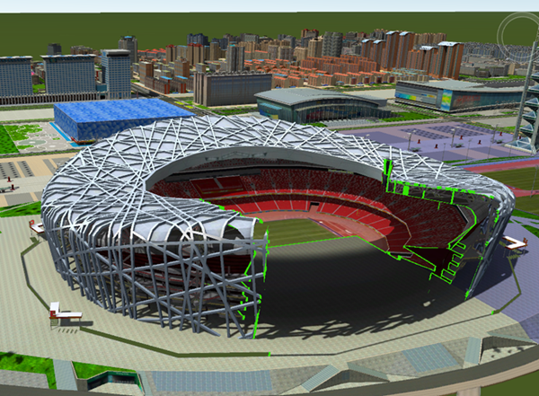
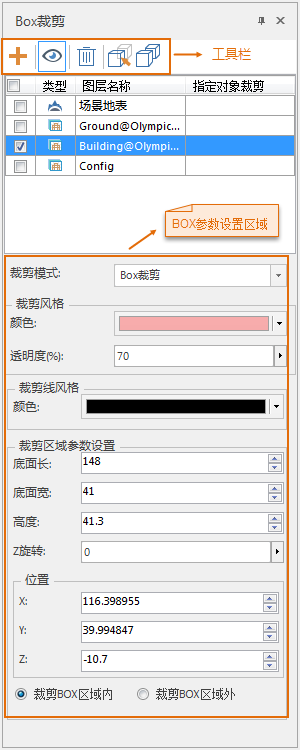
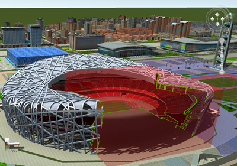
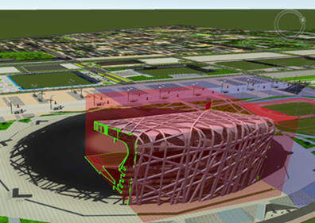

---
id: ClipByBox
title: Box裁剪  
---  
### 使用说明

“Box裁剪”功能，对图层设定Box区域，立体显示Box区域内或者区域外的场景。

Box裁剪支持指定对象裁剪，实现对精细模型缓存的指定对象进行裁剪。

Box裁剪支持的数据类型有：倾斜摄影数据，模型数据集、模型OSGB缓存，管线数据集、管线scv缓存、管线OSGB缓存；不支持的数据类型有：CAD数据集、模型scv缓存。

使用Box裁剪，可以在不进入模型内部的情况下，直接查看模型内部的情况。例如，对鸟巢模型设定局部Box裁剪区域，得到的效果如下图所示。

  

### 操作步骤

1. 在“ **场景** ”选项卡上的“ **浏览** ”组中，单击“ **场景裁剪** ”下拉按钮，在弹出的下拉菜单中选择“ **Box裁剪** ”，弹出“ **Box裁剪** ”面板。
2. 在图层列表框中，勾选要进行Box裁剪的图层。
3. 若需要对精模缓存的子对象进行裁剪，则可单击工具栏中的指定对象裁剪按钮，单击精模缓存中需要进行裁剪的子对象，配合 **Shift** 键可以实现选择多个子对象。BOX裁剪窗口中“指定对象裁剪”文本框中会新增选中的子对象ID。若不需要直接进行步骤4即可。单击全部对象参与裁剪按钮即可退出指定对象裁剪进行全部对象参与裁剪操作。
4. 单击工具栏中的添加裁剪区域 按钮，在场景中绘制一条边线，系统会自动生成一个以此边线的长度为长、宽、高的Box。生成的Box的长、宽、高、Z轴旋转角度以及位置信息（X、Y、Z），可以在“裁剪区域参数设置”处进行修改。如下图中所示。
5. 工具栏中“可见性”按钮可以控制裁剪的形状显示与否，选中“可见性”按钮，可以显示裁剪区域的形状，反之。默认为选中“可见性”按钮。  
  

其中，“裁剪线风格”中设置的是绘制的Box与模型数据相切割的边沿线的颜色，如上图中所示的绿色线条部分。

6. 根据使用需要，可以设置裁剪Box区域内数据或裁剪Box区域外数据。如下图所示，为两种不同设置的对比。    
    

### 注意事项

Box裁剪功能，只是设置场景中的模型等数据在Box区域内或者区域外是否显示，并不对其进行裁剪操作。

