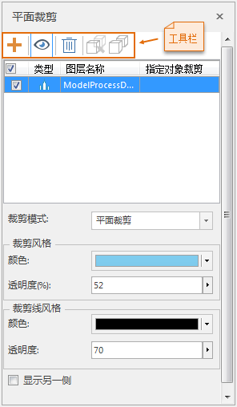
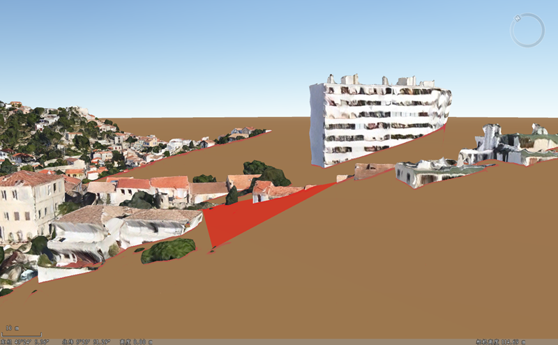
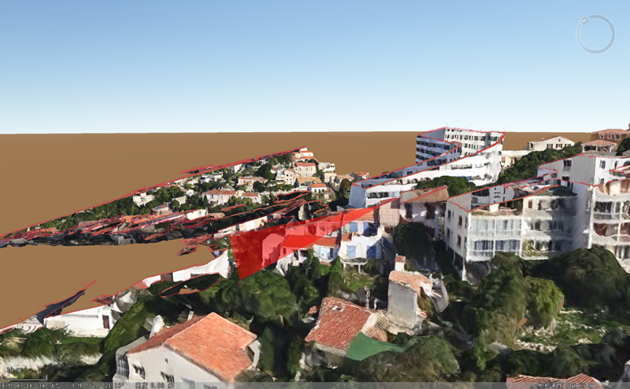

---
id: ClipByFlat
title: 平面裁剪  
---  
### 使用说明

“平面裁剪”功能，实现对指定图层绘制平面后，只显示平面单侧的场景。

### 操作步骤

1. 在“ **场景** ”选项卡上的“ **浏览** ”组中，单击“ **场景裁剪** ”下拉按钮，在弹出的下拉菜单中选择“ **平面裁剪** ”，弹出“ **平面裁剪** ”面板，如下图所示。     
  
 
2. 在图层列表框中，勾选要进行平面裁剪的图层，选中的待裁剪的图层效果如下图所示。   
  

3. 若需要对精模缓存的子对象进行裁剪，则可单击工具栏中的指定对象裁剪按钮，单击精模缓存中需要进行裁剪的子对象，配合 **Shift** 键可以实现选择多个子对象。BOX裁剪窗口中“指定对象裁剪”文本框中会新增选中的子对象ID。若不需要直接进行步骤4即可。单击全部对象参与裁剪按钮即可退出指定对象裁剪进行全部对象参与裁剪操作。
4. 单击工具栏中的添加裁剪区域 按钮，在场景中绘制三角平面。对于逆时针绘制的平面，裁剪掉三角面所在平面的下面数据；对于顺时针绘制的平面，裁剪掉三角面所在平面的上面数据。以逆时针绘制三角面为例，待裁剪图层平面裁剪效果如下图所示。
5. 工具栏中“可见性”按钮可以控制裁剪的形状显示与否，选中“可见性”按钮，可以显示裁剪区域的形状，反之。默认为选中“可见性”按钮。  
  

6. "平面裁剪"面板中“裁剪线风格”处可设置颜色和透明度，单击对应下拉按钮，进行设置即可。
7. 勾选“显示另一侧”复选框，即能显示另一侧的效果，如下图所示。  
  
  
  
### 注意事项

平面裁剪不支持对初始地面的裁剪。

