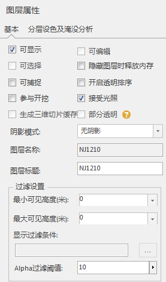

**使用说明**  
　　“ **场景** ”选项卡下“ **属性** ”组内的“ **图层属性**
”命令，可以用来查看或设置当前图层的属性。当前图层，即在图层管理器中当前选中的图层。  
　　当当前图层发生变化时，属性面板中的“图层标题”等属性值将跟着发生变化。  
　　图层属性面板中，根据图层类型的不同，将显示出对应类型可查看或设置的属性。下图便是图层属性共有部分：  
  

  
**基本操作部分参数说明**

  1. **可显示** ：勾选“可显示”复选框，可以显示图层中的所有对象。
  2. **可选择** ：勾选“可编辑”复选框，可以选中对象进行对象编辑。。
  3. **可捕捉** ：勾选“可捕捉”复选框，可以选中图层对象的顶点。
  4. **可编辑** ：勾选“可编辑”复选框，可以选中对象进行对象编辑。
  5. **隐藏图层时释放内存** ：只适用于缓存图层。只有当前选择的图层为缓存图层时，该复选框被激活。勾选“隐藏图层时释放内存”复选框，可以实现隐藏缓存图层时，释放该图层的内存，减少内存占用。
  6. **开启透明排序** ：只适用于模型缓存图层。只有当前选择的图层为模型缓存图层时，该复选框被激活。勾选“开启透明排序”复选框，可以对当前模型缓存图层的对象按照对象透明度进行排序。
  7. **参与开挖** ：只适用于有倾斜摄影模型的缓存图层。只有当前选择的图层为含有倾斜摄影模型的缓存图层时，该复选框被激活。勾选“参与开挖”复选框，可以对当前图层中的倾斜摄影图层进行开挖。
  8. **接受光照** ：只适用于倾斜摄影图层和模型缓存图层。只有当前选择的图层为含有倾斜摄影图层或模型缓存图层时，该复选框被激活。只有当功能区“场景”选项卡中的“浏览”组中“可见”按钮被激活时，勾选“接受光照”复选框，可以使当前图层接受光照。
  9. **生成三维切片缓存** ：只有当前图层为点/线/面图层和模型图层，该复选框被激活。勾选“生成三维切片缓存”复选框，当保存工作空间文件类型为*.sxwu时，在保存的工作空间内添加一个标签用于iServer生成缓存。
  10. **阴影模式** ：阴影模式可以设置显示对象在模拟日照情况下的阴影。包括：“无阴影”、“显示选中对象阴影”和“显示所有对象阴影”。
    * 无阴影：表示图层中的所有对象的阴影均不显示。
    * 显示选中对象的阴影：表示图层中只有选中对象的阴影显示。
    * 显示所有对象阴影：表示图层中所有对象的阴影均显示。
  11. **过滤设置** ：可通过设置可见比例尺或者设置过滤条件对图层中的对象进行过滤。
  12. **最小/最大可见高度** ：设置基于相机的高度进行显示的阈值。例如最大可见高度设为50，则低于50便不显示对象。
  13. **显示过滤条件** ：只显示SQL语句过滤后的对象。
  14. **Alpha过滤阈值** ：低于Alpha过滤阈值的对象不显示。
  15. **启用时刷新** ：勾选“启用时刷新”复选框，即可在编辑图层属性的状态下实时刷新图层。

**矢量部分参数说明**

  1. **最小/最大可见距离** ：设置基于相机和对象空间距离进行显示的阈值。例如最大可见距离设为100，则高于100便不显示对象。
  2. **瓦片边长** ：切片的边长。
  3. **缓冲距离** ：面图层在贴对象情况下，向外扩展的距离。
  4. **渲染模式** ：每个对象根据其顶点顺序有两个面，可以选择“顺时针”或“逆时针”渲染其中一个面，也可以选择“双面”进行全部渲染。

**多边形偏移参数说明**

详细可参考[多边形偏移](../AdvancedLayserSetting/PolygonOffset.md)

  1. **偏移常量** ：获取或设置多边形偏移常量。当值为正值时，表示多边形朝屏幕外偏移；为负值时，表示多边形朝屏幕内偏移。
  2. **缩放因子** ：多边形偏移常量和多边形偏移深度斜率因子共同决定了多边形对象在屏幕深度方向的偏移量，设置多边形偏移常量和多边形偏移深度斜率因子，可用于解决多边形重叠时闪烁的问题。

**操作步骤**

  1. 在“ **图层管理器** ”中，选中要查看或设置属性的图层。
  2. 单击功能区 > “ **场景** ”选项卡 > “ **属性** ”组中的“ **图层属性** ”按钮。
  3. 弹出“ **图层属性** ”面板。

**相关主题**  
[线图层属性](../LayersManagement/Layer3DProperty_Line.md)  
[面图层属性](../LayersManagement/Layer3DProperty_Region  )  
[模型图层属性](../LayersManagement/Layer3DProperty_Model  l)  
[缓存图层属性](../LayersManagement/Layer3DProperty_ModelCache  l)  
[Tin地形图层属性](../LayersManagement/Layer3DProperty_TIN  l)  
[体元栅格图层属性](../LayersManagement/Layer3DProperty_VoxelGrid  l)  
[开启图层编辑](../DataProcessing/DTv_Editable  )  
[设置图层可见范围](../AdvancedLayserSetting/VisibleRanges  )  
[处理场景中栅格/影像图层](../AdvancedLayserSetting/Rastergroup3D  )  
[精细显示距离](../AdvancedLayserSetting/LODDistance  )  
[设置预加载范围](..//AdvancedLayserSetting/PreLoadRange  )  
[模型显示模式](../AdvancedLayserSetting/ModelDisplayMode  )   
[图层阴影](../AdvancedSceneSetting/ModelShade  )  
[淹没效果](../AdvancedLayserSetting/Layer3DProperty_Flooding  l)  
[分层设色表达/颜色表](../AdvancedLayserSetting/Layer3DProperty_HypsometricSetting  l)  
[多边形偏移](../AdvancedLayserSetting/PolygonOffset  l)

