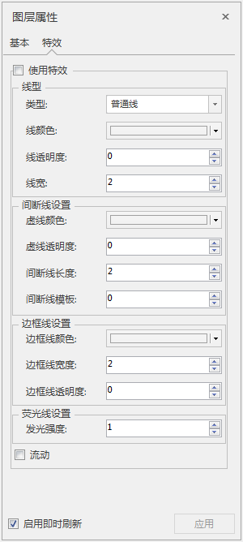

---
id: Layer3DProperty_Line
title: 三维线图层特效  
---  
在图层管理器中选中三维线图层作为当前图层，“图层属性”界面中会出现特效的设置选项。首先需要勾选使用特效复选框，激活特效设置控件，包含三维线图层的线型、间断线、边框线、荧光线等属性设置的功能控件。

  

  
### 线型设置

  * **类型** ：可单击类型右侧组合框的下拉按钮，在弹出的显示列表中选择一种类型，包括普通线、带箭头、间断线、边框线、荧光线、间断线（带箭头）、荧光线（带箭头）。
  * **线颜色** ：可单击线颜色右侧组合框的下拉按钮，在弹出的颜色面板中选择某一种颜色，则该三维线的像元将显示为指定的色彩。
  * **线透明度** :可单击线透明度右侧的向右箭头，弹出滑块，滑动滑块来调整透明度值，也可直接输入想要的透明度数值。
  * **线宽** :通过线宽右侧的上下箭头来调整线宽，也可直接输入线宽值。

### 间断线设置

当线型选择的是间断线或间断线（带箭头），间断线设置组内的控件可用，包括设置间断线的颜色、透明度、长度、模版。

  * **间断线颜色** ：可单击线颜色右侧组合框的下拉按钮，在弹出的颜色面板中选择某一种颜色，则该间断线的像元将显示为指定的色彩。
  * **间断线透明度** ：可单击间断线透明度右侧的向右箭头，弹出滑块，滑动滑块来调整透明度值，也可直接输入想要的透明度数值。
  * **间断线长度** :通过间断线长度右侧的上下箭头来调整间断线长度，也可直接输入间断线长度值。
  * **间断线模版** :可单击间断线模版右侧的向右箭头，弹出滑块，滑块滑动来调整间断线模版值，也可直接输入间断线模版的数值，每个数值对应一个模版。

### 边框线设置

当线型选择的是边框线或边框线（带箭头），边框线设置组内的控件可用，包括设置边框线的颜色、宽度、透明度。

  * **边框线颜色** ：可单击边框线颜色右侧组合框的下拉按钮，在弹出的颜色面板中选择某一种颜色，则该边框线的像元将显示为指定的色彩。
  * **边框线宽度度** :通过边框线长度右侧的上下箭头来调整边框线宽度，也可直接输入边框线宽度值。
  * **边框线透明度** ：可单击边框线透明度右侧的向右箭头，弹出滑块，滑动滑块来调整透明度值，也可直接输入想要的透明度数值。

### 荧光线设置

当线型选择的是荧光线或荧光线（带箭头），荧光线设置组内的控件可用，提供发光强度设置。

  * **发光强度** :通过发光强度右侧的上下箭头来调整发光强度值，也可直接输入发光强度值。

### 复选框流动设置

只有当线型选择的是间断线或间断线（带箭头），流动复选框可用，当勾选流动复选框，间断线呈现流动特效。

