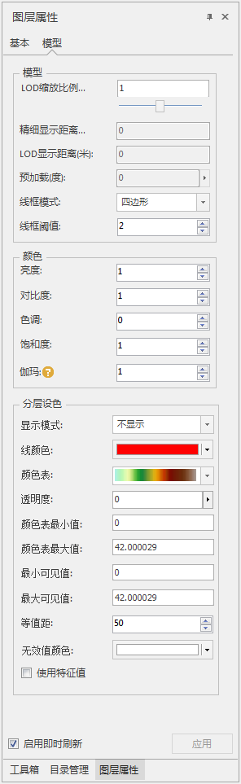

　　在图层管理器中选中模型图层作为当前图层，“图层属性”界面中会出现模型的设置选项。  aa
  

**模型显示参数**

  * **LOD缩放比例（倍）** ：模型LOD的不同层级之间切换距离的缩放倍数。
  * **线框模式** ：可以选择设置模型的线框类型,包含“三角形”、“四边形”和“草图”三种模式，详细参考[模型显示模式](../../SceneOperation/AdvancedLayserSetting/ModelDisplayMode.md)。

**颜色**

　　设置模型显示颜色的亮度、对比度、色调、饱和度以及伽玛值。其中伽玛用于控制图像中间色调灰阶亮度值

**分层设色**

　　分层设色默认依照模型高程进行分层，如果是“构建TIM”生成带特征值的模型，可以勾选使用特征值来进行分层设色，若无特征值则没有效果。

  * **最大/最小可见值** ：分层设色的显示范围。
  * **等值距** ：当显示模式为线填充或线面填充时，等值距的值为线之间的间距。
  * **无效值颜色** :模型分层设色设置无效值颜色。

具体可以参考[分层设色](../AdvancedLayserSetting/Layer3DProperty_HypsometricSetting.md)

