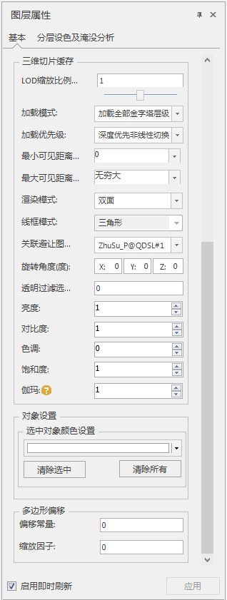
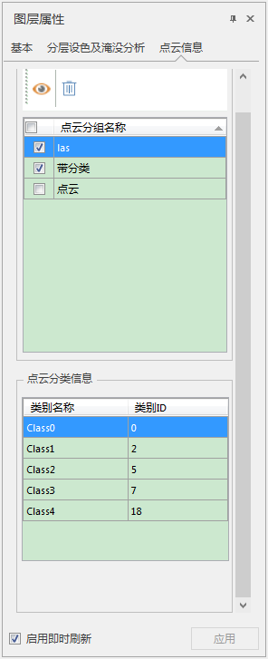

　　在图层管理器中选中缓存图层作为当前图层，“图层属性”界面中会出现缓存相关的设置选项。

  
  
**三维切片缓存参数**

  * **LOD缩放比例（倍）** ：模型缓存LOD的不同层级之间切换距离的缩放倍数。
  * **加载优先级** ：包含深度优先和层优先。
    1. **深度优先** ：优先加载当前视角范围内所有金字塔的所有切片。
    2. **层优先** ：优先加载当前金字塔层级的所有切片。
    3. **索引优先** ：根据索引加载，根据索引信息进行调度。
  * **透明过滤选择** ：针对模型缓存，选择对象时屏蔽低于过滤值的对象。
  * **线框模式** ：如果缓存是模型缓存，可以选择设置模型的线框类型,包含“三角形”、“四边形”和“草图”三种模式，详细参考[模型显示模式](../AdvancedLayserSetting/ModelDisplayMode.md)。

**特效属性设置**

**分层设色**

具体可以参考[分层设色](../AdvancedLayserSetting/Layer3DProperty_HypsometricSetting.md)

#### 淹没分析

具体可以参考[淹没效果](../AdvancedLayserSetting/Layer3DProperty_Flooding.md)

### 点云缓存信息

　　用于显示点云缓存文件的分组和分类信息。  
　　支持定位到指定点云分组以及删除所选点云分组。  
  

