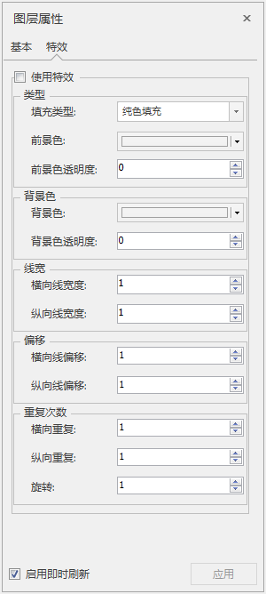

　　在图层管理器中选中三维面图层作为当前图层，“图层属性”界面中会出现特效的设置选项。首先需要勾选使用特效复选框，激活特效设置控件，包含三维线图层的类型、背景色、线框、偏移、重复次数等属性设置的功能控件。  
  
  
**使用特效** ：勾选“使用特效”复选框，激活特效参数设置面板。

**类型设置**

  * **填充类型** ：可单击填充类型右侧组合框的下拉按钮，在弹出的显示列表中选择一种类型，包括纯色填充、条纹填充、点填充、棋盘填充、网格填充。
  * **前景色** ：可单击前景色右侧组合框的下拉按钮，在弹出的颜色面板中选择某一种颜色，则该三维面前景色的像元将显示为指定的色彩。
  * **前景色透明度** :可单击前景色透明度右侧的向右箭头，弹出滑块，滑动滑块来调整透明度值，也可直接输入想要的透明度数值。

**背景色设置**

　　当面类型选择的是条纹填充、点填充、棋盘填充、网格填充，背景色设置组内的控件可用，包括设置背景色的颜色、透明度。

  * **背景色** ：可单击背景色右侧组合框的下拉按钮，在弹出的颜色面板中选择某一种颜色，则该三维面的背景色的像元将显示为指定的色彩。
  * **背景色透明度** ：可单击背景色透明度右侧的向右箭头，弹出滑块，滑动滑块来调整透明度值，也可直接输入想要的透明度数值。

**线宽设置**

　　当面类型选择的是条纹填充、点填充、棋盘填充、网格填充，线宽设置组内的控件可用，包括设置横向线宽度、纵向线宽度。

  * **横向线宽度** ：通过横向线宽度右侧的上下箭头来调整横向线宽度，也可直接输入横向线宽度值。
  * **纵向线宽度** :通过纵向线宽度右侧的上下箭头来调整纵向线宽度，也可直接输入纵向线宽度值。

**偏移设置**

　　当面类型选择的是条纹填充、点填充、棋盘填充、网格填充，偏移设置组内的控件可用，包括设置横向线偏移、纵向线偏移。

  * **横向线偏移** ：通过横向线偏移右侧的上下箭头来调整横向线偏移，也可直接输入横向线偏移值。
  * **纵向线偏移** :通过纵向线偏移右侧的上下箭头来调整纵向线偏移，也可直接输入纵向线偏移值。

**重复次数设置**

　　当面类型选择的是条纹填充、点填充、棋盘填充、网格填充，重复次数设置组内的控件可用，包括设置横向重复、纵向重复、旋转。

  * **横向重复** ：通过横向重复右侧的上下箭头来调整横向重复次数，也可直接输入横向重复次数。
  * **纵向重复** :通过纵向重复右侧的上下箭头来调整纵向重复次数，也可直接输入纵向重复次数。
  * **旋转** :通过旋转右侧的上下箭头来调整旋转角度值，也可直接输入旋转角度值。

