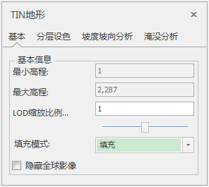

---
id: Layer3DProperty_TIN
title: TIN地形图层属性  
---  
在图层管理器中选中TIN地形图层作为当前图层，“图层属性”界面中会出现TIN地形相关的设置选项。

### TIN地形基本信息

  
  
  
  * LOD缩放比例（倍）：TIN地形LOD的不同层级之间切换距离的缩放倍数。
  * 填充模式：可以选择填充模式为“填充”和“轮廓”，轮廓则显示原始三角网

### 分层设色

具体可以参考[分层设色](../../SceneOperation/AdvancedLayserSetting/Layer3DProperty_HypsometricSetting)

### 坡度坡向分析

  

  
  * 全部显示：默认为“全部显示”，即该图层模型全部参与坡度坡向分析。 
  * 区域显示：勾选此项后，将鼠标移至场景区域时变为编辑划线状态，可在模型上点击勾绘一个多边形区域，表示该多边形区域内的模型进行坡度坡向分析，区域外不进行坡度坡向分析。
  * 选择区域：勾选此项后，激活“从数据集选择区域”的下拉框，选择当前工作空间打开的数据源。
  * 显示模式：提供了不显示、坡度、坡向以及坡度坡向四种模式，点击右侧下拉框选择。 
  * 颜色表：点击右侧颜色下拉框，选择填充缓存的颜色方案。
  * 颜色表最小值：输入数字，用于设置纹理颜色表最左侧颜色所对应的高程强度值，默认为模型高程强度值的最小值。 
  * 颜色表最大值：输入数字，用于设置纹理颜色表最右侧颜色所对应的高程强度值，默认为模型高程强度值的最大值。 
  * 最小可见值：输入数字，用于设置参与坡度坡向分析的模型高程强度值的最小值，默认为模型高程强度值的最小值。小于该值的模型将不进行坡度坡向分析。
  * 最大可见值：输入数字，用于设置参与坡度坡向分析的模型高程强度值的最大值，默认为模型高程强度值的最大值。大于该值的模型将不进行坡度坡向分析。 
  * 流动：勾选该项，分析区域内的箭头有流动效果。

### 淹没分析

具体可以参考[淹没效果](../../SceneOperation/AdvancedLayserSetting/Layer3DProperty_Flooding)

