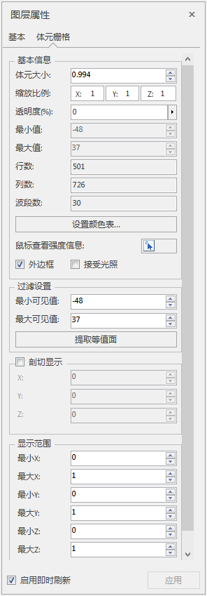

　　在图层管理器中选中体元栅格图层作为当前图层，“图层属性”界面中会出现体元栅格的设置选项。

  
  
**基本信息**

  * **体元大小** ：通过设置体元大小，设置体元栅格能显示的体元数量。值域范围[0.1,1]
  * **缩放比例** ：体元栅格根据X、Y、Z轴向缩放值进行缩放。
  * **透明度** ：体元栅格中体元的透明度。
  * **最大/小值** ：体元栅格的最大/小值。
  * **行/列/波段数** :体元栅格的行/列/波段数。
  * **鼠标查看强度信息** ：获取体元栅格该点处体元叠加的强度值，若体元的透明度为不透明，则为单个体元的强度值。
  * **外边框** ：设置包围盒的外边框是否可见。

**过滤设置**

  * **最大/最小可见值** ：最大/小可见值指的是体元栅格的强度值，仅显示最大最小可见度之间的体元栅格。

**剖切显示**

　　通过设置X、Y、Z值，设置X、Y、Z轴上的剖切面位置，其值域都为[0，1]。

**显示范围**

　　设置体元栅格的显示范围，通过设置最大/小的X、Y、Z，设置体元栅格显示范围，其值域都为[0，1]。

