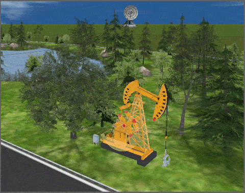

**使用说明**  
　　“添加静态模型”功能用于添加第三方数据模型到场景中的三维模型图层。能够加载到场景中的第三方数据模型的格式为：*.s3m,*.sgm,*.3ds,*.mesh,*.obj,*.dae,*.x,*.osg,*.osgb,*.stl,*.off，并且使用 *.sgm 格式文件可以支持三维动画帧模型的导入。

**操作步骤**

  1. 新建或打开一个场景窗口后，在指定的KML图层中添加静态模型，可通过以下两种方式添加：

**方式一** ：在“ **对象绘制** ”选项卡“ **模型对象** ”组中，单击“ **静态模型** ”按钮，弹出“打开三维模型数据文件”对话框。
  * 若当前场景中已添加了 KML/KMZ 图层，确保KML/KMZ图层处于可编辑状态。
  * 若当前场景中未添加 KML/KMZ 图层，可在“图层管理器”下普通图层的集合结点单击右键，在弹出的菜单内选择"新建KML图层"或"添加KML图层"选项进行新建或添加KML/KMZ图层；也可在“ **对象绘制** ”选项卡的“ **图层** ”组中选择“加载KML”或“新建KML”选项进行新建或添加KML/KMZ图层。
  * 在“打开三维模型数据文件”对话框中选择要添加第三方数据模型文件，然后单击对话框中的“打开”按钮即可将所选的数据模型添加到指定三维图层，单击“取消”按钮，即可取消操作。

**方式二**：若场景中已添加KML图层，可在“图层管理器”中单击KML图层右键，选择“添加”菜单中的“静态模型...”项，弹出“打开三维模型文件”对话框，直接选择模型文件即可。  

  * 此时，鼠标移动至场景中，鼠标状态改变，可在场景中任意位置单击鼠标左键添加模型，应用程序会自动弹出“KML对象属性”面板，可对模型的大小、位置以及角度等进行修改设置。单击鼠标右键即可退出添加模型操作。
  * 新加载的数据模型将添加到当前场景中指定的三维图层中，并显示在场景中的模拟地球上。对于保存类型为 KML 文件的图层，在图层管理器中指定保存模型的三维图层结点下一级将增加所添加模型的结点。在该结点上双击鼠标左键，三维球体将漫游到该模型对应的数据范围，进行指定比例显示。
  * 还可在图层管理器中选中已经添加的模型对象，选择右键“属性”命令，在弹出的“KML对象属性”对话框“对象风格”中，可以对模型颜色、透明度进行设置。  
  
  
**备注**  
  * *.sgm 格式的数据是 SuperMap 公司提供的一种全新的三维模型存储格式（SGM: SuperMap Global Model），这种格式的模型数据能够以极快的速度加载到场景中进行显示与浏览。
  * 为了保证 3ds 模型加载效率和显示效果，在制作模型时，有一些注意事项和优化措施，具体请参见：[模型制作注意事项](../DataProcessing/Attention.md)。
  * 目前仅对动画模型支持高亮选中模型的操作，暂不支持模型的移动、拉伸等操作。
