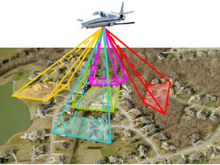

---
id: Aboutosgb
title: 倾斜摄影概述  
---  
倾斜摄影（oblique
image）是指由一定倾斜角的航摄相机所获取的影像。倾斜摄影技术是国际测绘遥感领域近年发展起来的一项高新技术，它颠覆了以往正射影像只能从垂直角度拍摄的局限。通过在同一飞行平台上搭载多台传感器，同时从一个垂直、四个倾斜等五个不同的角度采集影像，获取地面物体更为完整的信息。
  
  
 
  
**倾斜摄影技术有以下4个特点：**

  * 反映地物周边真实情况：可以获取多个视点和视角的影像，从而得到更为详尽的侧面信息，具有较高的分辨率和较大的视场角，地物遮挡现象较为突出。
  * 倾斜摄影可实现单张影像测量：通过配套软件的应用，可基于成果影像进行包括高度、长度、面积、角度、坡度等测量，扩展了倾斜摄影技术在行业中的应用。
  * 提升城市三维建模效率：针对各种三维数字城市的应用，利用航空摄影大规模成图的特点，加上从倾斜摄影影像提取及贴纹理的方式，能够有效的降低三维建模成本。
  * 数据量小易于网络发布：相较于三维GIS技术应用庞大的三维数据，应用倾斜摄影技术获取的影像的数据量要小得多，其影像的数据格式可采用成熟的技术快速进行网络发布，实现共享应用。

**倾斜摄影的应用：**

航空倾斜影像不仅能够真实地反应地物情况，而且还通过采用先进的定位技术，嵌入精确的地理信息、更丰富的影像信息、更高级的用户体验，极大地扩展了遥感影像的应用领域。该技术可广泛应用于应急指挥、国土安全、城市管理、房产税收等领域。

