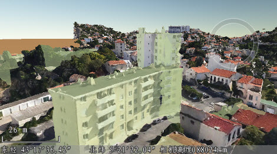
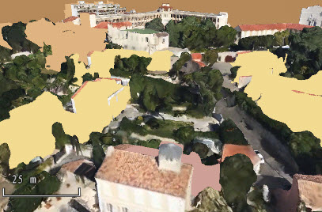
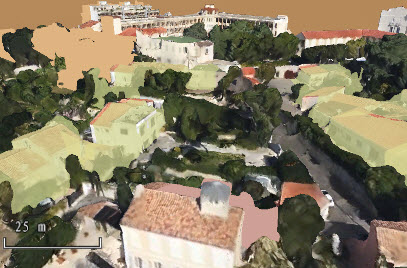

**使用说明**

倾斜摄影模型数据通常与该模型区域对应的矢量数据配合操作。同时加载模型缓存数据和对应的矢量数据后，可对它们进行常规浏览、设置贴对象高度模式、制作三维专题图、查看修改属性信息等操作。同时，应用商店的插件中，增加了
OSGB 示范插件，该插件提供了设置选择集风格、OSGB 模型压平等功能。

**操作步骤**

下面以数据准备加载的 OSGB.scp 缓存数据和示范数据中的矢量数据为例，详细介绍这两个数据的相关浏览操作：

  1. 打开安装路径\SampleData\3D\OSGB\vector.udb 数据源，将数据源中的 vector 面数据集添加到模型数据所在的场景中。
  2. 在“图层管理器”中，双击“vector@vector”或者“OSGB”图层，快速定位到模型数据所在位置，通过漫游、缩放、鼠标拉平、竖起、旋转等操作，可调整场景的浏览视角。 
  3. 选中图层管理器中的“vector@vector”图层，在“风格设置”选项卡的“拉伸设置”组中，单击“高度模式”右侧下拉按钮，选择“贴对象”模式，此时，矢量面数据会贴附到对应位置的模型数据上，在“风格设置”选项卡的“填充风格”组中，将“透明度”设置为50%，可更清晰的看到贴对象高度模式的效果，如下图所示。  
  

  4. 场景中可单击选中某个矢量面对象，单击鼠标右键，选择“属性”项，查看该对象的相关属性，同时可在“属性”对话框中进行属性值的修改。
  5. 在“ **场景** ”选项卡的“ **数据** ”组中，单击“专题图”按钮，在弹出的“制作专题图”对话框中，选择单值专题图，制作一幅默认风格的单值专题图。
  6. 在“专题图”参数面板中，单击“单值表达式”右侧下拉按钮，选择“year”字段，并按需要修改颜色方案。在单值子项列表中，选中值为1995的子项，单击工具条中的按钮，在“填充符号选择器”中将“透明度”设置为50%，此时可看到专题图下模型数据的大致轮廓。如下图所示：  
    

 

