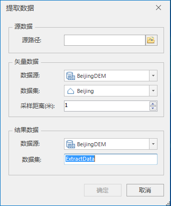

**使用说明**

“提取数据”功能支持在倾斜摄影模型上将二维点、线、面相对于倾斜模型表面提取为三维点、线、面数据。

**操作步骤**

  1. 在工作空间管理器中右键单击“数据源”，选择 “打开文件型数据源”，打开包含二维点/线/面数据集的数据源。
  2. 在“ **三维数据** ”选项卡的“ **倾斜摄影** ”组内的“ **提取三维数据** ”下拉按钮中，单击“ **提取数据** ”按钮，弹出“倾斜模型提取”对话框，如下图所示：  
  

  3. 源数据选择：鼠标单击源路径右侧打开文件路径按钮，在弹出的“打开”对话框中选择倾斜摄影配置文件（*.scp），单击“打开”即可；也可在文本框中直接输入配置文件所在的文件夹路径及名称。
  4. 矢量数据设置，包括数据源和数据集选择。 
       * 数据源：鼠标单击右侧下拉按钮，在弹出的下拉列表中选择二维点/线/面数据集所在的数据源。
       * 数据集：鼠标单击右侧下拉按钮，在弹出的下拉列表中选择二维点/线/面数据集。
       * 采样距离：指在指定的平面和高度范围内，输出采样点的频率。默认为1，单位为米。
  5. 结果数据设置，包括数据源选择和数据集命名。 
       * 数据源：默认选择矢量数据所在的数据源，支持自由选择。
       * 数据集：默认字段名为ExtractData，支持自定义。
  6. 设置完以上参数后，单击“确定”按钮，即执行在倾斜摄影模型上提取指定矢量数据集所在处的底部高程值和拉伸高度值，提取为三维矢量数据集并存储至指定数据集。

**注意事项**

  1. 工作空间中必须有打开的数据源。

 

