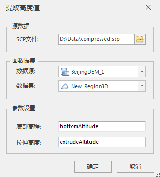

---
id: AchieveHeight
title: 提取高度值  
---  
### 使用说明

根据指定面数据集，在倾斜摄影模型上提取面数据集范围内的底部高度和拉伸高度值。目前倾斜摄影数据提取高度值仅支持OSGB格式的.scp文件

### 操作步骤

  1. 在工作空间管理器中右键单击“数据源”，选择 “打开文件型数据源”，打开包含点数据集的数据源。
  2. 在“ **三维数据** ”选项卡的“ **倾斜摄影** ”组中的“ **数据管理** ”下拉按钮中，单击“ **提取高度值** ”按钮，弹出“提取高度值”对话框，如下图所示：     
  

  3. 源数据选择：鼠标单击源路径右侧打开文件路径按钮，在弹出的“打开”对话框中选择倾斜摄影配置文件（*.scp），单击“打开”即可；也可在文本框中直接输入配置文件所在的文件夹路径及名称。
  4. 面数据集设置，包括数据源和数据集选择。 
      * 数据源：鼠标单击右侧下拉按钮，在弹出的下拉列表中选择面数据所在的数据源。
      * 数据集：鼠标单击右侧下拉按钮，在弹出的下拉列表中选择面数据集。
  5. 提取高度值参数设置，涉及命名底部高程和拉伸高度字段名，用于存储获取的底部高程值和拉伸高度值。 
      * 底部高程：默认字段名为bottomAltitude，支持自定义。
      * 拉伸高度：默认字段名为extrudeAltitude，支持自定义。
  6. 设置完以上参数后，单击“确定”按钮，即执行在倾斜摄影模型上提取指定面数据集范围内的底部高程值和拉伸高度值，并存储到指定属性字段下。

### 注意事项

  1. 工作空间中必须有打开的数据源。
  2. 倾斜摄影数据提取高度值仅支持OSGB格式的.scp文件。

