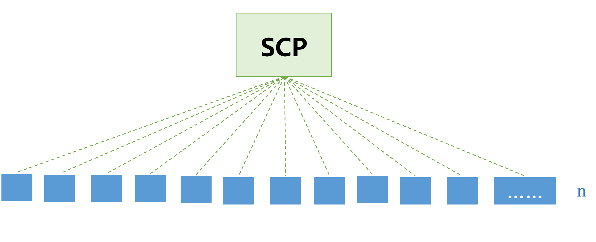
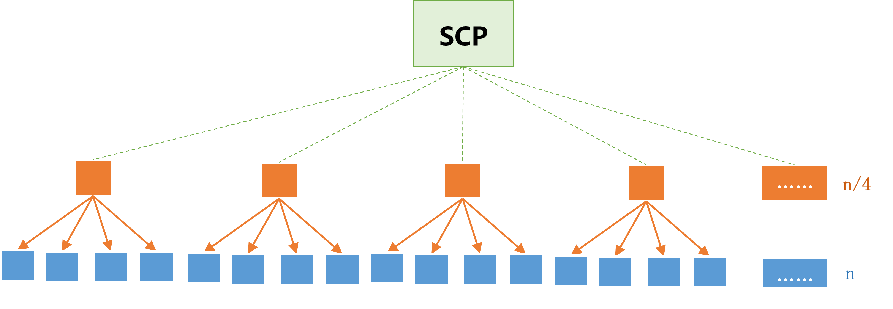
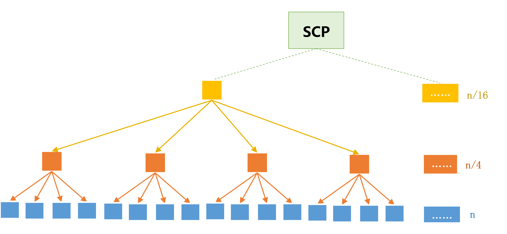
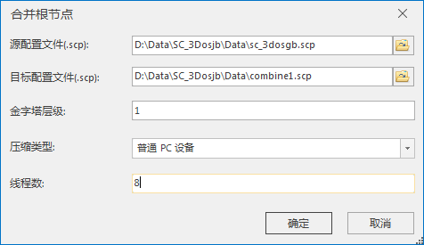
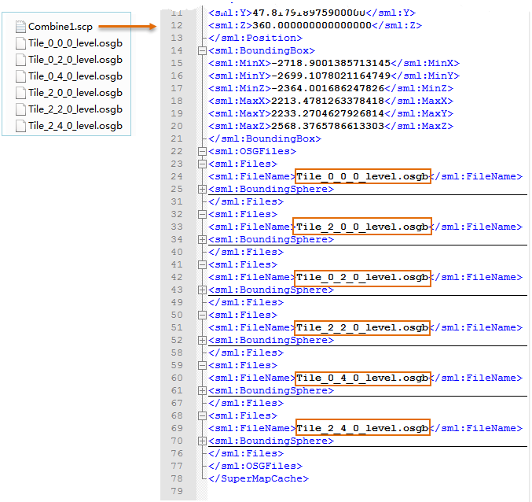

**使用说明**

倾斜摄影模型数据通常采用分块（Tile）方式存储，即一定空间范围的模型划为一个块并存储在一个文件夹中，每个文件夹下包含了一个根节点文件及若干子节点文件。SuperMap通过索引文件（*.scp）记录的根节点相对路径来加载模型，如下示意图（蓝色方框表示模型根节点）。

  

  
当模型空间范围广、数据量庞大，使得模型被划分为很多个根节点，读取这些根节点花费时间较长导致加载模型较慢，此时，需要进行合并根节点来提升加载效率。

“合并根节点”功能则是将相邻一定空间范围的根节点合并为一个根节点，即向上抽稀生成了一层更为粗糙的LOD层级，每合并一次，模型根节点数量减少约为原始数量的1/4。合并示意如下图（蓝色方框表示合并前的模型根节点，橙色方框表示合并一次的根节点；黄色方框表示合并二次后的根节点）：

  

  

**操作步骤**

  1. 在“ **三维数据** ”选项卡中“ **倾斜摄影** ”内“ **数据处理** ”下拉按钮中，在弹出的下拉菜单中选择“ **合并根节点** ”按钮，弹出“合并根节点”对话框，如下图所示：  
  

  2. 源配置文件(.SCP)：单击右侧按钮，在弹出的“打开”对话框中选择待合并处理的配置文件，单击“打开”即可；也可在文本框中直接输入配置文件所在的文件夹路径及名称。
  3. 目标配置文件(.SCP)：单击右侧按钮，在弹出的“打开”对话框中设置合并后配置文件的路径及名称，单击“保存”即可；也可在文本框中直接输入配置文件所在的文件夹路径及名称。
  4. 金字塔层级：用于设置根节点合并次数，默认值为1，即模型根节点将进行一次合并处理。
  5. 压缩类型：下拉选择纹理压缩的类型，压缩选择项如下，请根据使用终端设备类型选择。 
       * **普通PC设备** ：默认为普通PC设备，生成适用于 PC 机（个人计算机）上通用的压缩纹理格式。
       * **不压缩** ：纹理不进行压缩处理。
  6. 线程数：分配给合并根节点操作的线程数，默认为8个线程参与操作，用户可自定义线程数。
  7. 设置完以上参数后，单击“确定”按钮，即可执行合并根节点的操作。

本案例的数据经合并处理后，30个根节点被合并，生成了6个新的根节点，则在目标文件夹下新生成了一个scp配置文件及6个osgb根节点文件，
SCP配置文件（Combine1.SCP）记录了合并后模型对应的根节点名称。

  
  
**注意事项**

  1. 设置目标配置文件的路径时，应设置在源配置文件的同级目录中，否则若采用iServer发布数据服务将产生错误。

 

