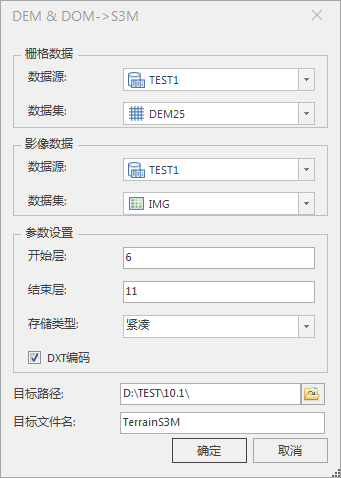

**使用说明**

DEM/DOM转为OSGB功能，可将DEM(Digital Elevation Map，数字高程模型)与DOM((Digital Orthophoto
Map, 数字正射影像)数据一并转换为OSGB格式的数据。
生成OSGB数据前，需要分别加载栅格数据集和影像数据集来显示地形和影像，在场景中则存在两个图层。生成OSGB数据后，通过加载一个*.scp
格式的缓存文件来直接加载地形和影像，大大提升了浏览性能。

**操作步骤**

  1. 在工作空间管理器中右键单击“数据源”，选择 “打开文件型数据源”，打开包含DEM和DOM数据的数据源。
  2. 在“ **三维数据** ”选项卡中“ **倾斜摄影** ”内“ **类型转换** ”下拉按钮中，单击“ **DEMDOM→OSGB** ”按钮，弹出“DEM/DOM→OSGB”对话框，如下图所示：  
  
  
  3. 在对话框中的“栅格数据”处设置数据源和数据集，下拉选择将要生成OSGB数据的栅格数据集，即DEM数据。
  4. 在对话框中的“影像数据”处设置数据源和数据集，下拉选择将要生成OSGB数据的影像数据集，即DOM数据。
  5. 在对话框中的“参数设置”处设置相关参数，具体说明如下： 
       * **开始层** ：设置生成OSGB缓存数据的开始层数。可使用默认值。
       * **结束层** ：设置生成OSGB缓存数据的结束层数。可使用默认值。
       * **DXT编码** ：默认勾选。勾选后将进行纹理压缩，生成适用于PC端的DXT数据格式。
  6. 目标路径：设置生成的OSGB文件保存路径。鼠标单击右侧按钮选择存放路径，也可直接输入目标路径。
  7. 目标文件名：设置OSGB文件，直接在文本框中输入文件名。
  8. 设置完以上参数后，单击“确定”按钮，即可执行DEMDOM转换OSGB的操作。根据示范数据中的 BeijingDEM生成OSGB 缓存数据，生成结果如下图所示：  
  

**注意事项**

  1. 打开数据源后，DEM/DOM→OSGB功能才可被激活。

 

