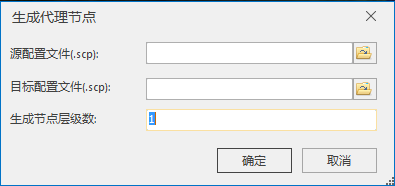
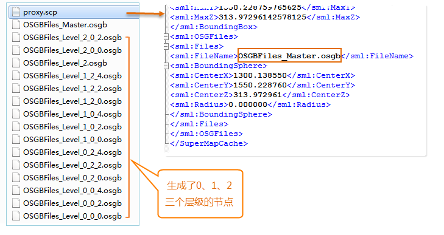

**使用说明**

“生成代理节点”功能为倾斜摄影模型生成了不包含模型数据的代理节点及新的配置文件。

当倾斜摄影模型的数据范围较大，导致同时加载和显示这些模型需要占用较大的内存资源，
“生成代理节点”则为该倾斜摄影模型的加载提供了动态的显示调度策略；当用户进行移动、缩放操作，一旦三维场景视口外发生变化，程序也将实时更新需显示的模型，这样可大大提升倾斜摄影模型显示效率、降低内存占用。

**操作步骤**

  1. 在“ **三维数据** ”选项卡中“ **倾斜摄影** ”内“ **数据处理** ”下拉按钮中，单击“生成代理结点”按钮，弹出“生成代理节点”对话框，如下图所示：  
  
  
  2. 源配置文件（.scp）：单击右侧按钮，在弹出的“打开”对话框中选择待生成代理节点的配置文件，单击“打开”即可；也可在文本框中直接输入配置文件所在的文件夹路径及名称。
  3. 目标配置文件（.scp）：单击右侧按钮，在弹出的“打开”对话框中设置代理节点配置文件的路径和名称，单击“保存”即可；也可在文本框中直接输入配置文件所在的文件夹路径及名称。
  4. 生成点层级数：用于设置代理节点的层级数，建议设置为3~5。
  5. 设置完以上参数后，单击“确定”按钮，即可执行生成代理节点的操作。生成结果如下图所示：  
  
  
本例的生成节点层级数设置为3，则生成了0、1、2三个层级的代理节点；结果数据中的SCP配置文件只记录了一个最粗糙根节点文件名称（OSGBFiles_Master.osgb），场景将通过最粗糙节点再向下索引更为精细层级的代理节点。

**注意事项**

  1. 设置目标配置文件的路径时，应设置在源配置文件的同级目录中，否则若采用iServer发布数据服务将产生错误。

 

