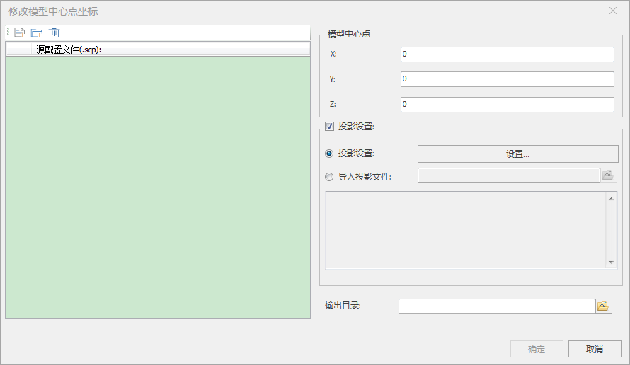
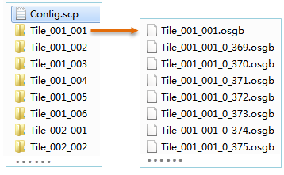

**使用说明**

倾斜摄影模型的坐标由配置文件（*.SCP）的标签和数据本身的坐标信息决定，加载同一测区的多份数据时，由于每份数据都有一个自己的中心点坐标，因此需要分别加载多个SCP配置文件。

“修改模型中心点”功能通过修改数据本身的坐标信息，用于解决同一测区的倾斜摄影数据多个中心点的问题，实现一个SCP配置文件加载所有数据的要求，不仅如此还支持多个模型批量修改中心点和设置投影信息。

**操作步骤**

  1. 在“ **三维数据** ”选项卡中“ **倾斜摄影** ”内“ **数据处理** ”下拉按钮中，单击“ **修改模型中心点** ”按钮，弹出“修改模型中心点”对话框，如下图所示：
  

  2. 源配置文件（.scp）：单击"打开scp配置文件"按钮，在弹出的“打开”对话框中选择待修改中心点的配置文件，单击“打开”即可；也可单击“打开文件夹下所有scp文件”按钮，在弹出的对话框中选择要修改模型中心点的文件夹。
  3. 模型中心点X：输入新的X坐标值。
  4. 模型中心点Y：输入新的Y坐标值。
  5. 模型中心点Z：输入新的Z坐标值。
  6. 投影设置：设置*.scp文件的投影信息，目前提供两种方式：
       * 投影设置：当选择“投影设置”单选框，单击右侧“设置...”按钮，弹出“坐标系设置”对话框，选择一种投影作为目标文件的坐标系。设置目标投影的具体操作，请参考“[投影设置](../../../DataProcessing/Projection/PrjCoordSysSettingWin  )”窗口。 
       * 导入投影文件：当选择“导入投影文件”单选框，单击右侧文件浏览图标按钮，在弹出的“选择”窗口中，选择投影信息文件并导入即可。同时，下方文本框中会显示所选投影文件的坐标系详细信息。
  7. 输出目录：单击右侧按钮，在弹出的“浏览文件夹”对话框中设置修改中心点后数据保存的路径，单击“确定”接口；也可在文本框中直接输入文件夹路径。
  8. 设置完以上参数后，单击“确定”按钮，即可执行修改模型中心点操作。

“修改模型中心点”功能在指定的输出目录下生成了一份与源SCP文件同名的配置文件，以及存储在各个文件夹中的*.osgb文件，如下图所示：

  
