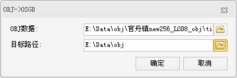
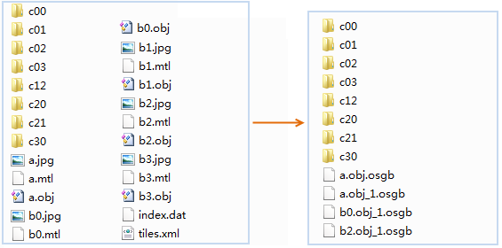

---
id: OBJToOSGB
title: OBJ转换为OSGB数据  
---  
### 使用说明

OBJ→OSGB 功能可将由 PhotoScan 导出的 OBJ 格式的倾斜摄影模型数据转换为 OSGB 格式的数据。

### 操作步骤

  1. 在“ **三维数据** ”选项卡中“ **倾斜摄影** ”内“ **数据处理** ”下拉按钮中，单击“ **OBJ→OSGB** ”按钮，即可弹出“OBJ→OSGB”对话框，如下图所示：   
  
 
  2. 在“OBJ→OSGB”对话框中，单击“OBJ数据”右侧按钮，在弹出的“打开”对话框中，选择 PhotoScan 的 *.xml 配置文件，也可直接在文本框中输入 *.xml 配置文件的路径和名称。
  3. 单击“目标路径”组合框右侧的按钮，在弹出的“浏览文件夹”对话框中设置 OSGB 数据的保存路径，或在文本框中直接输入 OSGB 数据的保存路径。
  4. 设置好以上参数后，单击对话框中的“确定”按钮，即可将 OBJ 文件转换为 OSGB 数据保存在目标路径中，如下图所示：        
  

