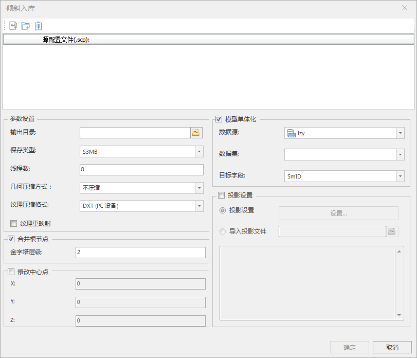

**使用说明**

“倾斜入库”功能支持倾斜摄影数据进行合并根节点、纹理压缩、模型单体化以及修改模型中心点等操作，实现批量处理倾斜摄影模型，可实现倾斜算子一体化处理，支持多线程。

**操作步骤**

  1. 在“ **三维数据** ”选项卡上的“ **倾斜摄影** ”组中，单击“ **倾斜入库** ”按钮，弹出“倾斜入库”对话框，如下图所示。  
   
  
  2. 单击“添加scp配置文件”，在弹出的“打开”对话框中，选择 *.scp 文件，或者通过单击“打开文件夹下所有scp文件”按钮，添加源配置文件。
  3. 输出目录：设置结果数据存放路径。
  4. 保存类型：设置结果数据的数据类型，包括OSGB、S3M、S3MB。
  5. 线程数：设置倾斜入库操作的线程数，默认为8。
  6. 纹理压缩：可选，勾选“纹理压缩”后，选择压缩类型。目前支持的压缩类型为：不压缩、PC设备(DDS)、iOS系列设备、Android 系列设备和WebP，默认为“不压缩”。对于不同用途的数据，采用不同的纹理压缩方式，以减少纹理图像所使用的显存数量。详细信息请参见"[压缩并单体化](OSGBCompress)"。

     - **PC设备(DDS)** ：适用于 PC 机（个人计算机）上通用的压缩纹理格式。
     - **iOS系列设备** ：适用于苹果 iOS 设备上通用的压缩纹理格式。
     - **Android 系列设备** ：适用于 Android 设备上通用的压缩纹理格式。
     - **WebP** ：一种图片压缩格式，可大幅减少文件大小。

  7. 投影设置目前提供两种方式：
       * **投影设置** ：当选择“投影设置”单选框，单击右侧“设置...”按钮，弹出“坐标系设置”对话框，选择一种投影作为目标文件的坐标系。设置目标投影的具体操作，请参考[“投影设置”窗口](../../../DataProcessing/Projection/PrjCoordSysSettingWin  )。
       * **导入投影文件** ：当选择“导入投影文件”单选框，单击右侧文件浏览图标按钮，在弹出的“选择”窗口中，选择投影信息文件并导入即可。同时，下方文本框中会显示所选投影文件的坐标系详细信息。
  8. 合并根节点：可选，勾选“合并根节点”后，设置金字塔层级。金字塔层级是用于设置根节点合并次数，默认值为1，即模型根节点将进行一次合并处理。 详细信息请参见"[合并根节点](CombineOSGB  l)"。
  9. 模型中心点：可选，勾选“模型中心点”后，设置模型中心点X、Y、Z坐标值。详细信息请参见"[修改模型中心点](ModifyCenter  l)"。
  10. 模型单体化：可选，勾选“模型单体化”后，设置叠加到模型上的矢量面所在的数据源、数据集和目标字段。详细信息请参见"[压缩并单体化](OSGBCompress)"。
  11. 设置好以上参数后，单击“确定”按钮。

**注意事项**

  1. 倾斜入库源数据仅支持OSGB格式的.scp文件。

 

