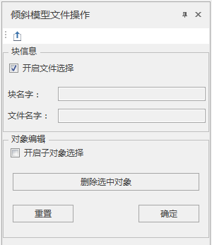
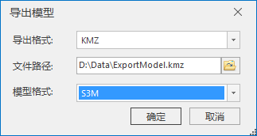

---
id: FileSelect
title: 文件选择  
---  
### 使用说明

倾斜摄影模型数据通常采用分块（Tile）方式存储，即一定空间范围的模型划为一个块并存储在一个文件夹中。为了便于查看某区块的模型存放路径，提供了“文件选择”功能，能够便捷地查看被选中模型所在的块（文件夹）及模型文件名称。

### 操作步骤

  1. 在三维场景中加载倾斜摄影模型配置文件；
  2. 在“ **三维数据** ”选项卡的“ **倾斜摄影** 选择”组内的“ **倾斜操作** ”下拉按钮中，单击“ **文件选择** ”按钮，弹出“倾斜摄影选择文件”的显示框，此时相当于激活文件选择功能；
  3. 在场景中鼠标单击倾斜摄影模型的任意部分，场景将高亮显示所点击模型的块，“倾斜摄影选择文件”对话框中将显示所点击模型的“块名字”和“文件名字”，如下图所示：     
  4. 开启对象选择，能删除选中对象。点击“确定”按钮删除源数据中的选中对象；可以点击“重置”，对之前的操作进行重置。
  5. 导出模型：支持将选中模型数据集中的任意一个或多个模型导出为OSGB、KMZ、KML、S3M、OFF、STL、GLTF和DAE文件保存。单击“ **导出** ”按钮，弹出“导出模型”对话框，如下图所示：具体参数设置请参考[导出模型](../../DataProcessing/ModelExport)。  
  
   

其中，块名字表示被选中倾斜摄影模型所在的文件夹；文件名字表示被选中模型的文件全称。

### 注意事项

  重置只能回退到本次在场景中打开的初始数据。如删除选中对象后，将倾斜图层移除，再重新加载进来的倾斜不能进行重置。

