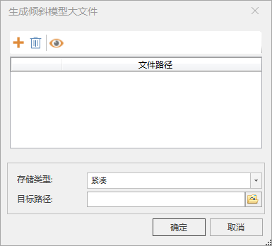

---
id: GenerateBigfile
title: 模型生成大文件  
---  
### 使用说明

倾斜摄影缓存或模型缓存数据分块存储在多个文件夹中，每个文件夹下存有很多个被划分为不同LOD层级的模型文件，场景需通过读取这些碎文件的方式实现加载浏览。

为了进一步提升倾斜摄影缓存和模型缓存的加载浏览效率，程序提供“生成倾斜模型大文件”功能，可以将存储在多个文件夹下的诸多碎文件生成为一个SqlLite
大文件。

### 操作步骤

  1. 在“ **三维数据** ”选项卡的“ **倾斜摄影** ”组中的“ **数据管理** ”下拉按钮中，单击“ **生成大文件** ”按钮，弹出“生成倾斜模型大文件”对话框，如下图所示：         
  
  
  2. 单击“添加数据集”按钮，在弹出的对话框中待生成大文件的模型配置文件，单击“打开”即可。
  3. 存储类型：系统提供了紧凑的存储类型，将每个缓存文件夹下的碎文件生成为一个文件。
  4. 目标路径：单击右侧按钮，在弹出的“浏览文件夹”对话框中设置大文件数据保存的路径，单击“确定”按钮；也可在文本框中直接输入文件夹路径。
  5. 设置完以上参数后，单击“确定”按钮，即可执行模型生成大文件操作。

### 注意事项

  1. 源配置文件（*.SCP）中< sml:FileType> </sml:FileType>标签的类型应为”OSGBFile”，若为其他格式，请使用“生成配置文件”功能为模型重新生成配置文件。

