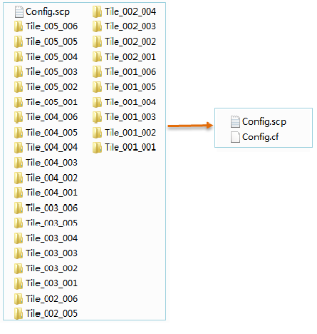

**使用说明**

倾斜摄影模型数据分块存储在多个文件夹中，每个文件夹下存有很多个被划分为不同LOD层级的*.osgb模型文件，场景需通过读取这些碎文件的方式实现加载浏览倾斜摄影模型。

为了进一步提升倾斜摄影模型的加载浏览效率，程序提供“生成倾斜模型大文件”功能，可以将存储在多个文件夹下的诸多碎文件生成为一个*.cf格式的倾斜摄影模型大文件。

**操作步骤**

  1. 在“ **三维数据** ”选项卡的“ **倾斜摄影** ”组中的“ **数据管理** ”下拉按钮中，单击“ **模型生成大文件** ”按钮，弹出“生成倾斜模型大文件”对话框，如下图所示：  
   
  
  2. 源配置文件(.SCP)：单击右侧按钮，在弹出的“打开”对话框中选择待生成大文件的模型配置文件，单击“打开”即可；也可在文本框中直接输入配置文件所在的文件夹路径及名称。
  3. 目标路径：单击右侧按钮，在弹出的“浏览文件夹”对话框中设置大文件数据保存的路径，单击“确定”按钮；也可在文本框中直接输入文件夹路径。
  4. 设置完以上参数后，单击“确定”按钮，即可执行模型生成大文件操作。

生成功后，在目标文件夹下生成了一份与源配置文件同名的配置文件(*.SCP)与紧凑缓存文件(*.cf)，结果如下图：

  

**注意事项**

  1. 源配置文件（*.SCP）中<sml:FileType> </sml:FileType>标签的类型应为”OSGBFile”，若为其他格式，请使用“生成配置文件”功能为模型重新生成配置文件。

 

