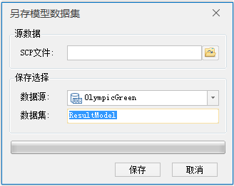

---
id: LayerSaveModelDataset
title: 保存到模型数据集  
---  
### 使用说明

倾斜摄影模型另存到模型数据集。

### 操作步骤

  1. 在“ **三维数据** ”选项卡的“ **倾斜摄影** ”组中的“ **数据管理** ”下拉按钮中，单击“ **保存到模型数据集** ”按钮，弹出如下对话框：   
  

  2. 在SCP文件对应的右侧文本框中输入倾斜摄影模型的配置文件（格式为*.scp）路径，也可以通过文本框后的“浏览”按钮来选择路径。
  3. 选择另存的模型数据集保存的数据源，并且在数据集右侧的文本框中输入一段字符串作为模型数据集的名称，确认保存完成操作。

### 注意事项

  1. 工作空间中必须有打开的数据源，保存以数据集名称命名的模型数据集。

