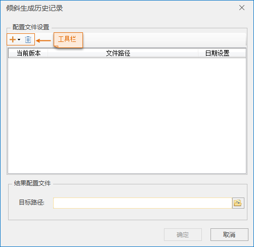
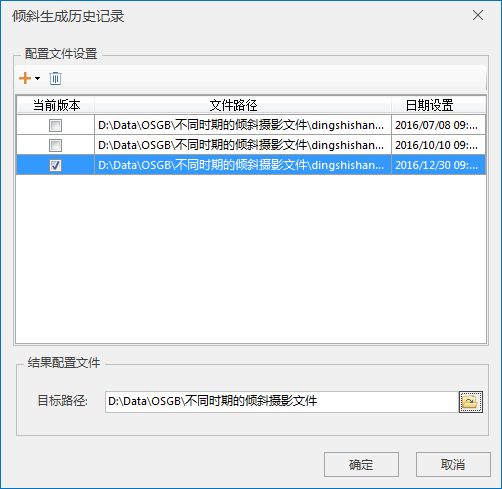
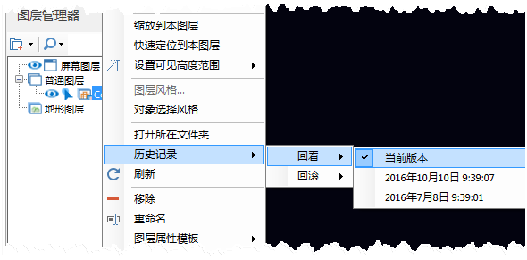
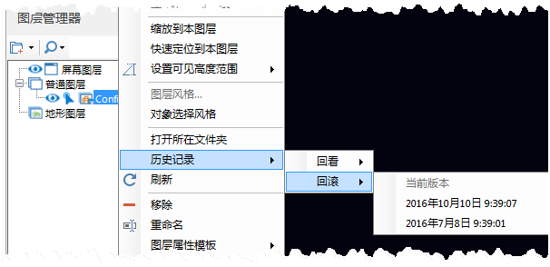

---
id: OSGBHistoryProduce
title: 生成历史记录  
---  
### 使用说明

生成历史记录功能是选择同一区域多个时期的倾斜摄影文件，分别设置倾斜摄影模型产生的时间，在确定的当前版本上生成历史记录，方便统一管理同一区域的倾斜摄影文件，生成的三维切片缓存文件（*.scp）支持回看或回滚到指定时期的倾斜摄影文件，实现对历史记录的管理。

### 操作步骤

  1. 在“ **三维数据** ”选项卡中“ **倾斜摄影** ”内“ **配置文件** ”下拉按钮中，单击“ **生成历史记录** ”按钮，弹出“倾斜生成历史记录”对话框，如下图所示：   
  
  2. 在“倾斜生成历史记录”对话框上的工具栏中单击添加下拉箭头按钮，在弹出的下拉菜单中选择“添加配置文件”或“加载文件夹下所有缓存”进行不同时期倾斜摄影数据的添加。其中，“添加配置文件”一次只能加载一个缓存文件，“加载文件夹下所有缓存”能批量添加一个文件夹下的所有缓存文件，加载的缓存文件名称必须相同。
  3. 在“日期设置”处鼠标单击进行日期选择或直接输入日期，在“当前版本”中勾选一个倾斜摄影文件作为当前版本。
  4. 设置结果配置文件存储路径。鼠标单击“目标路径”后的浏览文件夹按钮进行路径选择或在文本框内直接输入路径名称。完成生成历史记录的相关参数设置，如下图所示：  
  
  5. 单击“确定”按钮，执行生成历史记录操作，指定的目标路径下生成三维切片缓存文件（*.scp）。
  6. 新建场景后，在“图层管理器”中，单击“普通图层”结点右键，选择“添加三维切片缓存图层”项，将生成的含有历史记录的三维切片缓存文件添加到当前场景中。
  7. 单击加载的三维切片缓存图层右键，在弹出的右键菜单选择“历史记录”，弹出的“回看”、“回滚”选项可用。选择指定时间，即能回看或回滚到指定时间的倾斜摄影文件，如下图所示：  
    

### 注意事项

  1. 倾斜生成历史记录中加载的缓存名称必须相同，否则无法进行生成历史记录操作。

