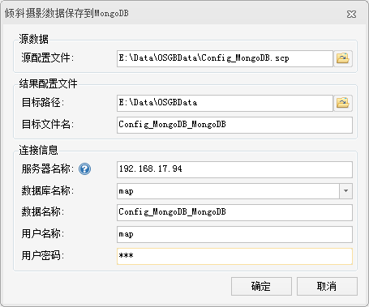

**使用说明**

“保存到MongoDB”功能可将根据源 *.scp 文件，将其关联的 *.osgb 数据保存到 MongoDB 数据库中，并生成一个新的 *.scp
配置文件。由于 OSGB 数据量较大，通过该功能将OSGB数据保存到 MongoDB 之后，便于数据分享与发布。只要能连接到 OSGB 数据所在的
MongoDB 服务器，共享 *.scp 配置文件后，通过 *.scp 文件即可浏览或处理OSGB数据。

**操作步骤**

  1. 在“ **三维数据** ”选项卡的“ **倾斜摄影** ”组中的“ **数据管理** ”下拉按钮中，单击“ **保存到MongoDB** ”按钮，弹出“倾斜摄影数据保存到MongoDB”对话框，如下图所示。  
    
 
  2. 单击源数据处“源配置文件”组合框中单击右侧的“打开”按钮，在弹出的“打开”对话框中选择 OSGB 数据的配置文件。
  3. 在对话框的“结果配置文件”处，可设置目标文件的保存路径和文件名，具体说明如下： 
       * **目标路径** ：用于设置新生成的 *.scp 文件保存路径，可单击该组合框右侧按钮，选择文件保存路径，或在文本框中直接输入保存路径。目标文件的默认保存路径与源配置文件的路径一致。
       * **目标文件名** ：用于设置 *.scp 配置文件的保存名称，在文本框中直接输入文件名即可。
  4. 对话框中的“连接信息”区域可设置 MongoDB 服务器和数据库的相关信息，在使用该功能前，需先启动 MongoDB 服务，有关MongoDB 请参看“[MongDB 使用说明](../../../TechDocument/MongoDBDatabaseGuide  )”。有关参数说明如下： 
       * **服务器名称** ：输入 MongoDB 数据库服务器名称，或输入服务器的 IP 地址。
       * **数据库名称** ：设置倾斜摄影数据需要保存到的 MongoDB 数据库名称。若服务器是以非用户验证方式启动 MongoDB，则可单击下拉按钮选择服务器中已存在的数据库，或直接输入新数据库名称创建一个数据库；若服务器以用户验证方式启动 MongoDB，则不支持新建数据库，也不能读取到已有的数据库名称，只能在文本框中输入已存在数据库名称。
       * **数据名称** ：用于设置和显示倾斜摄影数据在 MongoDB 数据库中的保存名称。
       * **用户名称** ：输入MongoDB数据库的用户名称，若为新建的数据库，则设置其用户名。
       * **用户密码** ：输入进入 MongoDB 数据库的密码，若为新建的数据库，则对其设置密码。
  5. 设置完以上参数后，单击“确定”按钮，即可执行 OSGB 数据保存到 MongoDB 数据库的操作。

 

