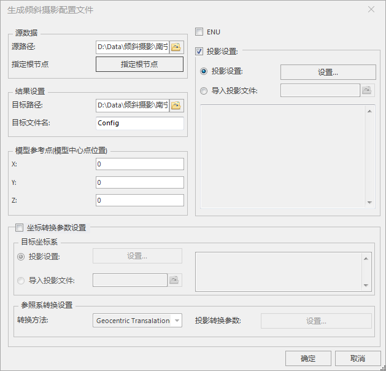
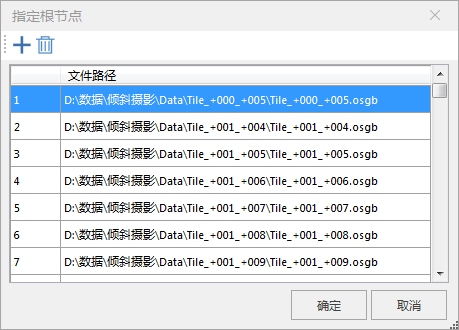

---
id: OSGBToScp
title: 生成配置文件  
---  
### 使用说明

“生成配置文件”功能是将倾斜摄影数据生成 *.scp 格式的配置文件。

在球面场景中可直接加载*.scp 格式的三维切片缓存文件，实现对三维切片缓存数据的批量加载与浏览。

### 操作步骤

  1. 在“ **三维数据** ”选项卡中“ **倾斜摄影** ”内“ **数据管理** ”下拉按钮中，单击“ **生成配置文件** ”按钮，弹出“生成倾斜摄影配置文件”对话框，如下图所示。
  

  2. 源数据设置
      * 单击“源路径”右侧文件浏览按钮，在弹出的“浏览文件夹”对话框中选择 OSGB 数据所在文件夹，或者在文本框中直接输入 OSGB 数据所在的文件夹路径。
      * 指定根节点：支持设置指定根节点。单击“指定根节点”按钮，弹出“指定根节点”对话框，显示文件路径，可以删除和增加根节点文件。如果已经指定了源路径，系统会自动读取文件夹路径下所有根节点数据，如下图：   
  
 
      * 元数据：支持设置元数据。单击“元数据”右侧文件浏览按钮，在弹出的“浏览文件夹”对话框中选择元数据文件，点击“打开”即可。
  3. 结果设置 
      * **目标路径** ：设置 *.scp 文件保存路径，单击右侧文件浏览按钮，选择文件保存路径，或者在文本框中直接输入保存路径。默认目标路径即为源OSGB 文件路径。
      * **目标文件名** ：设置 *.scp 文件名称，直接在文本框中输入文件名。
  4. 设置模型参考点，模型参考点也称为模型中心点位置，包括经度x、纬度y和高程z。默认值为（0,0,0）。
  5. 如果倾斜摄影模型是ENU坐标系，勾选“ENU”。否则勾选“投影设置”，设置 *.scp 文件的投影信息，目前提供两种方式： 
      * **投影设置** ：当选择“投影设置”单选框，单击右侧“设置...”按钮，弹出“坐标系设置”对话框，选择一种投影作为目标文件的坐标系。设置目标投影的具体操作，请参考[“投影设置”窗口](../../../DataProcessing/Projection/PrjCoordSysSettingWin)。
      * **导入投影文件** ：当选择“导入投影文件”单选框，单击右侧文件浏览图标按钮，在弹出的“选择”窗口中，选择投影信息文件并导入即可。同时，下方文本框中会显示所选投影文件的坐标系详细信息。
  6. 相关参数设置完后，“单击“确定”按钮，执行 OSGB 文件生成为配置文件的操作。

### 注意事项

  1. 若添加的文件夹存在子文件夹，则含有 OSGB 文件的子文件夹会添加到文件夹列表中，并生成 *.scp 配置文件。
  2. 若所添加的文件夹中 OSGB 文件缺失或不合法，输出窗口会提示失败信息，如： “文件夹“D:\data”添加失败，请检查该文件夹下OSGB文件是否完整！”。若 *.scp 文件生成失败，输出窗口也会提示失败信息。

