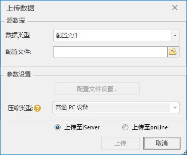
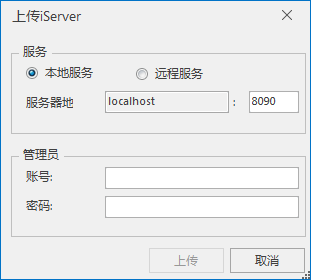
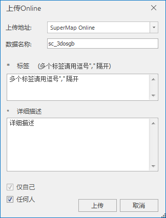

---
id: UploadOSGBData
title: 数据分享  
---  
### 使用说明

“数据分享”功能将本地倾斜摄影数据上传至iServer端和SuperMap Online，实现了数据的共享。

未生成配置文件的倾斜摄影模型数据，需要先进行配置文件生成操作。倾斜摄影模型数据压缩格式支持普通PC设备、iOS系统设备、Android系统设备，数据压缩转换为S3M格式。

### 操作步骤

  1. 在“ **三维数据** ”选项卡上的“ **倾斜摄影** ”组，单击“ **数据分享** ”按钮，弹出“上传数据”对话框。   
  

  2. 源数据选择：选择数据类型和对应的配置文件。 
      * 数据类型：单击“数据类型”右侧的下拉箭头，在弹出的下拉菜单中选择一种数据类型。提供“配置文件”和“文件夹”两种数据类型，默认选择“配置文件”。
      * 配置文件：单击配置文件右侧的浏览图标，选择指定的配置文件或文件夹，也可以直接输入文件所在路径。
  3. 参数设置：数据分享前，进行数据处理的参数设置，包括数据压缩类型选择，依据选择的压缩类型，压缩转换为S3M格式。当源数据选择时选择的数据类型是文件夹，“配置文件设置…”按钮可用，需要首先进行“生成配置文件”操作。
      * 配置文件设置：单击“配置文件设置…”按钮，弹出“生成倾斜摄影配置文件”对话框，具体操作参见帮助文档“[生成配置文件](OsgbToScp)”。
      * 压缩类型：单击“压缩类型”右侧的下拉箭头，在弹出的下拉菜单中选择压缩的类型，提供“普通PC设备”、“iOS系统设备”、“Android系统设备”共三种压缩类型，默认为普通PC设备。
  4. 数据分享平台选择：目前提供两种平台：iServer、Online。单选“上传至iServer”或“上传至Online”。
  5. 设置完以上参数，单击“上传”按钮，弹出上传平台连接配置对话框。       
    
 

   设置完连接配置后，单击“上传”按钮，完成数据上传操作。

