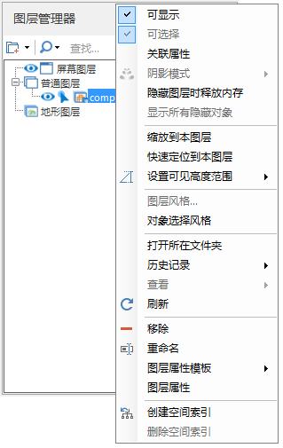
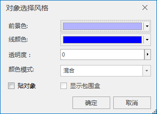

**使用说明**

OSGB图层的右键菜单提供了对倾斜摄影模型图层操作的一些工具，例如：关联属性表、对象选择风格设置、历史记录管理等。

**操作步骤**

  1. 新建球面场景。在工作空间管理器中右键单击“场景”，选择 “新建球面场景”。
  2. 加载三维切片缓存。在图层管理器中选中普通图层，右键单击“添加三维切片缓存图层”，或在“ **场景** 选项卡上的“ **数据** ”组中，单击“ **缓存** ”下拉按钮，在弹出的下拉菜单中选择“加载缓存...”，具体操作参见帮助文档“[加载三维缓存](../LayersManagement/CacheButton  )”。
  3. 右键单击三维切片缓存图层，弹出右键菜单，如下图所示。
  

  4. 以下详细介绍"对象选择风格"、"历史记录"的操作。
  5. 对于对象选择风格功能，单击右键菜单中的“对象选择风格”，弹出“对象选择风格”对话框。  
  

      * 可设置选中的倾斜摄影模型对象的显示风格，包括前景色、线颜色、透明度和颜色模式，其中颜色模式提供混合、替换两种模式，显示效果有“贴对象”、“显示包围盒”两个选项框。
  6. 对于历史记录功能，单击右键菜单中的“历史记录”，弹出右键菜单，提供回看和回滚两个选项。
       * 回看：单击对应时间信息，即能查看选中时间前的倾斜摄影模型显示效果。
       * 回滚：单击对应时间信息，即能返回并存储选中时间前的倾斜摄影模型数据。

 

