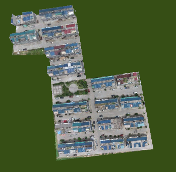

---
id: OSGBModelClip
title: 倾斜摄影数据裁剪  
---  
### 使用说明

倾斜摄影数据裁剪实现对倾斜摄影数据的自定义裁剪，可选择面或绘制面来作为裁剪区域。

该方法方便用户根据需求获取特定范围内的倾斜摄影数据。该方法同时适用于模型缓存。

### 操作步骤

  1. 新建球面场景。在工作空间管理器中右键单击“场景”，选择 “新建球面场景”。
  2. 加载三维切片缓存。在图层管理器中选中普通图层，右键单击“添加三维切片缓存图层”，或在“ **场景** 选项卡上的“ **数据** ”组中，单击“ **缓存** ”下拉按钮，在弹出的下拉菜单中选择“加载缓存...”，具体操作参见帮助文档“[加载三维缓存](../../LayersManagement/CacheButton)”。
  3. 在图层管理器中选中三维切片缓存文件图层，右键单击“快速定位到本图层”，在场景窗口按住鼠标滚轮将相机调整至便于裁剪模型的视角。
  4. 在“ **三维地理设计** ”选项卡上的“ **倾斜摄影操作** ”组中，单击“ **裁剪** ”按钮，弹出“倾斜摄影数据裁剪”面板。参数设置如下：   
      * 图层选择：单击“倾斜图层”右侧组合框的下拉箭头，选择裁剪对象所在的图层。
      * 裁剪面确定：提供“选择面”和“绘制面”两种裁剪面确定方式。 
        * 当点选"选择面"时，在场景中选择面对象，即完成裁剪面的确定。
        * 当点选“绘制面”时，使用工具栏中的“矩形”、“多边形”和“导入”来确定裁剪面。单击"矩形"或"多边形"工具，鼠标在场景中变为"+"号，鼠标单击绘制区域，右键单击结束绘制，完成裁剪面的确定。单击"导入"工具后弹出导入对话框，选择面数据集作为裁剪区域，如下图所示：   
  
 
      * 导出裁剪面：支持通过单击“导出”按钮，将绘制的裁剪面导出。
      * 裁剪参数设置： 
        * 单击"约束边界"右侧组合框的下拉箭头，在"软约束"和"硬约束"两种约束方式中选择一种，其中"软约束"是裁剪结果边界高程值和原来一致，保持不变，"硬约束"是裁剪结果边界高程和裁剪面边界高程值一致。
        * 单击"裁剪方式"右侧的组合框下拉箭头，在"保留区域内"和"保留区域外"两种裁剪方式中选择一种，其中"保留区域内"裁剪方式是裁剪获取封闭区域内的倾斜摄影数据，"保留区域外"裁剪方式是裁剪获取封闭区域外的倾斜摄影数据。
        * 默认勾选"预览"复选框，可实时预览裁剪结果。
      * 结果数据存储设置： 
        * 单击“路径”右侧的文件打开图标，选择裁剪结果的存储路径，也可以直接在文本框内输入存储路径。
        * 在“目标名称”右侧的文本框内输入裁剪结果存储的文件名。
  5. 单击“保存“进行倾斜摄影数据裁剪结果保存。示例多边形裁剪方式的结果如下：        
 

### 注意事项

  1. 在绘制裁剪区域时，需要俯视场景，以确保绘制点的准确性。

