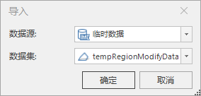

---
id: OSGBModelHollow
title: 倾斜摄影模型挖洞  
---  
### 使用说明

倾斜摄影模型挖洞实现对倾斜摄影模型的区域挖洞，可选择面或绘制面来作为挖洞区域。

### 操作步骤

  1. 新建球面场景。在工作空间管理器中右键单击“场景”，选择 “新建球面场景”。
  2. 加载三维切片缓存。在图层管理器中选中普通图层，右键单击“添加三维切片缓存图层”，或在“ **场景** ”选项卡上的“ **数据** ”组中，单击“ **缓存** ”下拉按钮，在弹出的下拉菜单中选择“加载缓存...”，具体操作参见帮助文档“[加载三维缓存](../../LayersManagement/CacheButton)”。
  3. 在图层管理器中选中三维切片缓存文件图层，右键单击“快速定位到本图层”，在场景窗口按住鼠标滚轮将相机调整至便于挖洞模型的视角。
  4. 在“ **三维地理设计** ”选项卡上的“ **倾斜摄影操作** ”组中，单击“ **挖洞** ”按钮，弹出“倾斜摄影模型挖洞”面板，具体参数设置如下： 
      * 图层选择：单击“倾斜图层”右侧组合框的下拉箭头，选择挖洞对象所在的图层。
      * 挖洞面确定：在挖洞面组中，提供“选择面”和“绘制面”两种挖洞面确定方式。 
        * 当点选"选择面"时，在场景中选择面对象，即完成挖洞面的确定。
        * 当点选“绘制面”时，使用工具栏中的“矩形”、“多边形”和“导入”来确定挖洞面。单击"矩形"或"多边形"工具，鼠标在场景中变为"+"号，鼠标单击绘制区域，右键单击结束绘制，完成挖洞面的确定。单击"导入"工具后弹出导入对话框，选择面数据集作为挖洞区域，如下图所示：   
    

      * 导出挖洞面：支持通过单击“导出”按钮，将绘制的挖洞面导出。
      * 参数设置："裁剪方式"为"保留区域外"，"保留区域外"挖洞方式是挖洞获取封闭区域外的倾斜摄影模型。 
        * 单击"约束边界"右侧组合框的下拉箭头，在"软约束"和"硬约束"两种约束方式中选择一种，其中"软约束"是挖洞结果边界高程值和原来一致，保持不变，"硬约束"是挖洞结果边界高程和裁剪面边界高程值一致。
        * 只有当约束边界为软约束时，“预览”复选框可用。当勾选“预览”复选框时，可实时预览挖洞结果。
  5. 单击“确定“进行挖洞操作。
  6. 单击"撤回"可撤销挖洞操作。

### 注意事项

  1. 在绘制挖洞区域时，需要俯视场景，以确保绘制点的准确性。
  2. 倾斜摄影挖洞操作也适用于模型缓存，并且支持模型缓存进行操作后查看/回滚历史记录。

