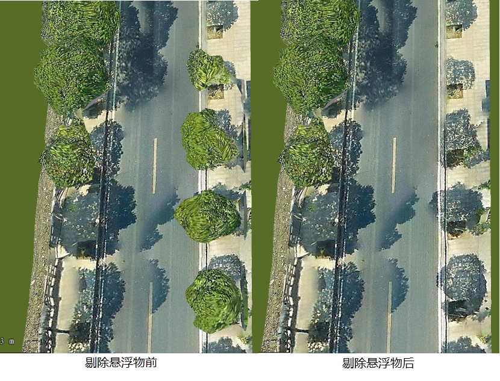

---
id: OSGBRemovalMatter
title: 剔除悬浮物  
---  
### 使用说明

倾斜摄影数据剔除悬浮物操作实现对倾斜摄影数据的自定义去除悬浮物，可通过绘制box来作为剔除悬浮物区域。

该方法方便用户根据需求去除特定范围内的倾斜摄影数据。

### 操作步骤

  1. 新建球面场景。在工作空间管理器中右键单击“场景”，选择 “新建球面场景”。
  2. 加载三维切片缓存。在图层管理器中选中普通图层，右键单击“添加三维切片缓存图层”，或在“ **场景** 选项卡上的“ **数据** ”组中，单击“ **缓存** ”下拉按钮，在弹出的下拉菜单中选择“加载缓存...”，具体操作参见帮助文档“[加载三维缓存](../../LayersManagement/CacheButton)”。
  3. 在图层管理器中选中三维切片缓存文件图层，右键单击“快速定位到本图层”，在场景窗口按住鼠标滚轮将相机调整至便于裁剪模型的视角。
  4. 在“ **三维地理设计** ”选项卡上的“ **倾斜摄影操作** ”组中，单击“ **剔除悬浮物** ”按钮，弹出“剔除悬浮物”面板。参数设置如下：   
      * 图层选择：单击“倾斜图层”右侧组合框的下拉箭头，选择裁剪对象所在的图层。
      * 参数设置：
        * 单击“添加”按钮，绘制悬浮物范围。
        * 单击“删除”按钮，删除选中的悬浮物范围。
  5. 单击“确定”按钮，进行倾斜摄影数据悬浮物去除。
   

### 注意事项

  1. 在绘制裁剪区域时，需要俯视场景，以确保绘制点的准确性。

