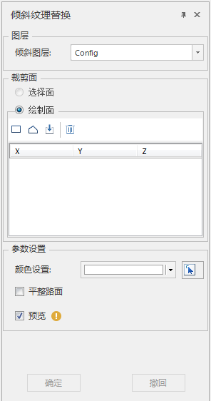
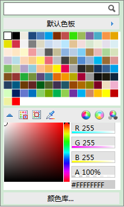
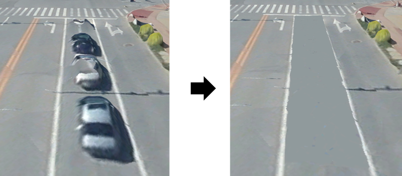

---
id: OSGBReplaceTexture
title: 倾斜摄影数据纹理替换  
---  
### 使用说明

“纹理替换”功能实现对倾斜摄影数据中指定对象的纹理进行替换，提供直接修改颜色和颜色镶嵌两种方法。该方法可以用于去除多余的对象或剔除不清楚的对象。

### 操作步骤

  1. 新建一个球面场景。在工作空间管理器中右键单击“场景”，选择 “新建球面场景”。
  2. 添加三维切片缓存数据。在图层管理器中右键单击“普通图层”，选择“添加三维切片缓存图层…”，指定OSGB数据存储路径，实现加载OSGB数据。
  3. 在“ **三维地理设计** ”选项卡上的“ **倾斜摄影操作** ”组中，单击“纹理替换”按钮，弹出“倾斜纹理替换”对话框，如下图所示：         
    

  4. 图层选择 
      * 打开倾斜纹理替换功能后，如果当前打开的场景中有多个倾斜图层，则需要对“倾斜图层”下“对象所在图层”对应的下拉列表中选择需要纹理替换的对象所在的图层；如果当前场景中只加载了需纹理替换的对象的数据集图层，则文本框会自动获取该图层。
  5. 修补面设置 
      * 默认选择“绘制面”进行修补面。绘制修补面提供矩形、多边形、导入和移除工具。
  6. 参数设置 
      * 颜色设置：单击下拉箭头弹出“颜色选择面板”，可以单击单个颜色或使用拾取工具（颜色面板上的吸管工具或颜色设置最右端的箭头工具）确定颜色。“颜色选择面板”如下图所示：     
  
 
      * 平整路面：默认不勾选，当选择颜色后，只修改纹理颜色。当勾选“平整路面”，实现对选中区域的压平操作。
      * 预览设置：默认勾选预览，则修改颜色时实时显示纹理替换效果。
  7. 设置完以上参数，单击“确定”按钮，即可执行倾斜纹理替换操作。会在指定的结果数据源下生成一个与数据集名称命名的模型数据集。
  8. 单击“撤回”，取消倾斜纹理替换操作。 
  9. 示例纹理替换前后对比效果图如下：   

   
 
  
 ### 注意事项

1. 倾斜摄影纹理替换操作也适用于模型缓存。

