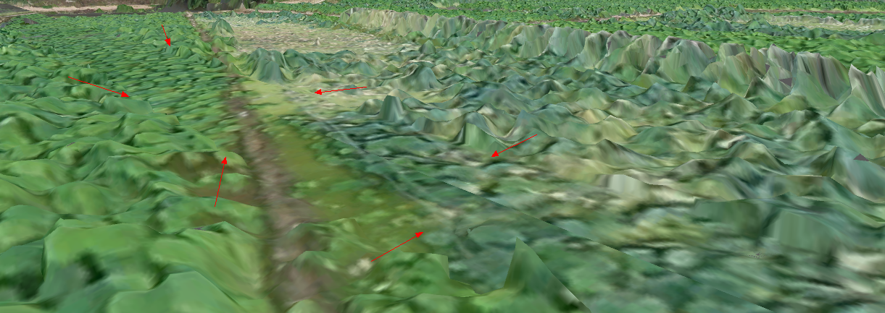

**使用说明**

倾斜摄影数据镶嵌操作是将选中的倾斜摄影图层与指定镶嵌面进行镶嵌的操作，被镶嵌倾斜摄影数据格式为OSGB，镶嵌图层同时支持二三维面图层。

**操作步骤**

  1. 新建球面场景。在工作空间管理器中右键单击“场景”，选择 “新建球面场景”。
  2. 加载缓存。在图层管理器中选中普通图层，右键单击“添加三维切片缓存图层”，或在“ **场景** ”选项卡上的“ **数据** ”组中，单击“ **缓存** ”下拉按钮，在弹出的下拉菜单中选择“加载缓存...”，具体操作参见帮助文档“[加载三维缓存](../LayersManagement/CacheButton  )”。
  3. 在图层管理器中选中三维切片缓存文件图层，右键单击“快速定位到本图层”，在场景窗口按住鼠标滚轮将相机调整至便于镶嵌模型的视角。
  4. 在“ **三维地理设计** ”选项卡上的“ **倾斜摄影操作** ”组中，单击“ **镶嵌** ”项，弹出“倾斜摄影数据镶嵌”面板，具体参数设置如下： 
       * 图层选择：单击“倾斜图层”组合框的下拉箭头，选择需镶嵌对象所在的图层。
       * 镶嵌面确定：单选“选择面”或“绘制面”确定镶嵌面类型。当选择“绘制面”，工具栏提供了“矩形”、“多边形”和“导入”三种方法进行镶嵌面的绘制，其中导入按钮单击后弹出的对话框，如下图所示。  
   
  
      * 导出镶嵌面：支持通过单击“导出”按钮，将绘制的镶嵌面导出。
      * 参数设置：裁剪方式为内外均保留，约束边界为硬约束，护坡宽度支持自定义大小，默认勾选“预览”复选框，即实时显示镶嵌结果。 缓坡宽度：默认为0，单位为米。直接输入数值或通过右侧的上下箭头调数值，确定护坡的宽度。  底部高程:设置镶嵌面的底部高程，这个操作不会改变镶嵌面的原始值。默认为0，单位为米。直接输入或者通过右侧的上下箭头调整数值，确定底部高程。
  5. 单击“确定“进行三维切片缓存镶嵌，镶嵌示例结果如下：  
    
  
  6. 单击“撤回“，撤销倾斜摄影模型镶嵌操作。

**注意事项**

  1. 在绘制镶嵌区域面时，尽量保证与镶嵌面的起伏一致。
  2. 倾斜摄影镶嵌操作也适用于模型缓存，并且支持模型缓存进行操作后查看/回滚历史记录。

 

