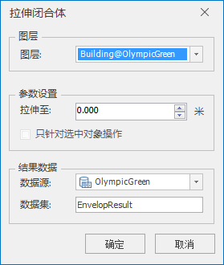
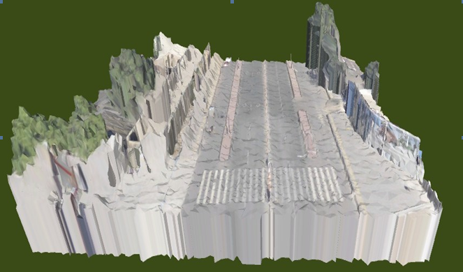

**使用说明**

“拉伸闭合体”功能是对倾斜摄影数据中选中的对象指定拉伸高程值后，构建拉伸闭合体。

**操作步骤**

  1. 新建一个球面场景。在工作空间管理器中右键单击“场景”，选择 “新建球面场景”。
  2. 添加三维切片缓存数据。在图层管理器中右键单击“普通图层”，选择“添加三维切片缓存图层…”，指定OSGB数据存储路径，实现加载OSGB数据。
  3. 在“ **三维地理设计** ”选项卡上的“ **倾斜摄影操作** ”组中，单击“拉伸闭合体”按钮，弹出“拉伸闭合体”对话框，如下图所示：  
     

  4. “图层”处选择进行拉伸闭合体的图层。单击下拉箭头，在下拉列表中进行选择。
  5. “参数设置”处设置模型向下拉伸至的高度值。当数值为正，如数值5，表示模型向下拉伸至地上5米处，构成闭合体；当数值为负，如数值-5，表示模型向下拉伸至地下5米处，构成闭合体。可以自定义是否勾选“只针对选中对象操作”。
  6. “结果数据”处选择结果存储的数据集和数据源。数据集默认名称为EnvelopResult，可自定义数据集名称。
  7. 点击“确定“进行拉伸闭合体操作：    
    

**注意事项**

  1. 操作拉伸闭合体前必须存在打开的数据源。
  2. 拉伸闭合体支持三维面和模型数据集。
  3. 如果倾斜摄影数据是投影坐标系，构建的拉伸闭合体也为投影坐标系，在加载显示前需要将拉伸闭合体转换为地理坐标。

 

